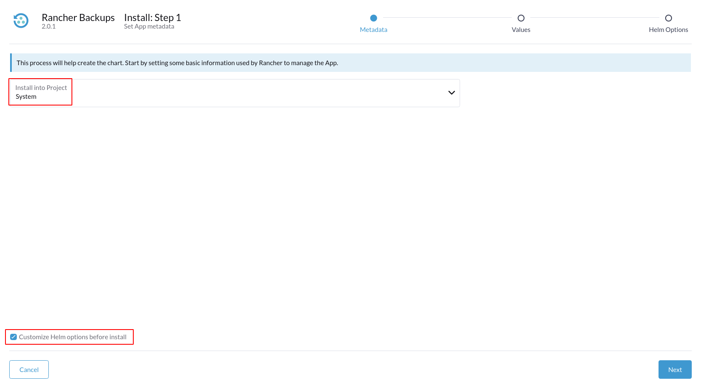
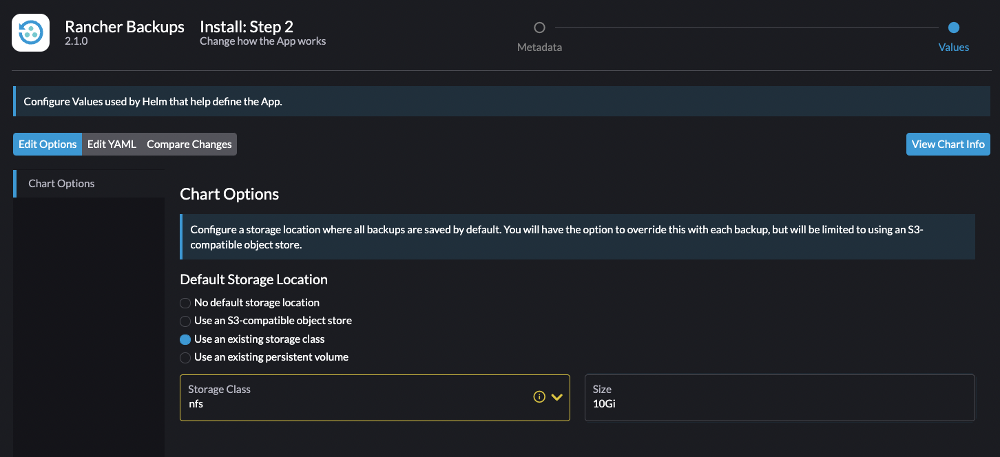
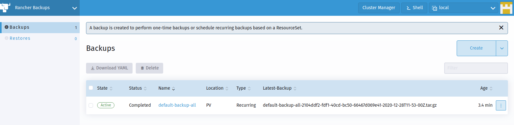
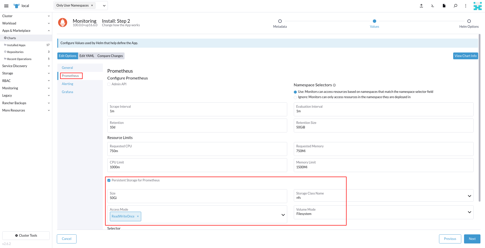
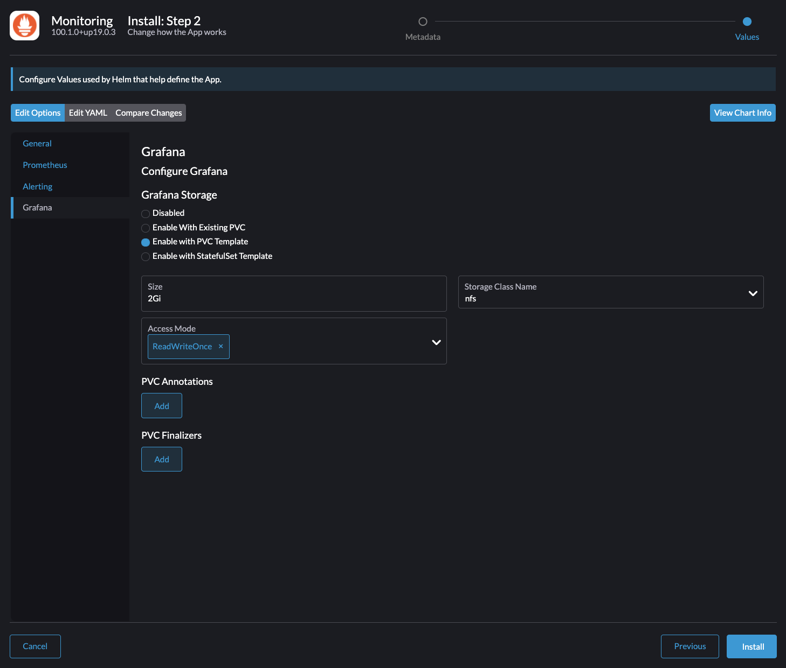
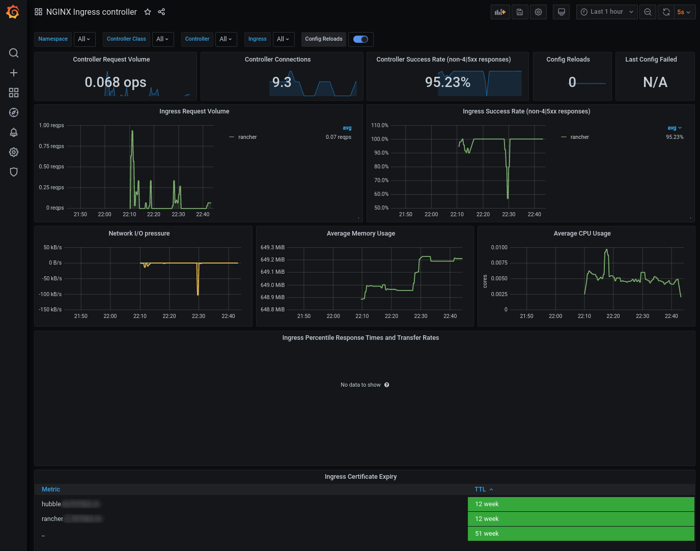
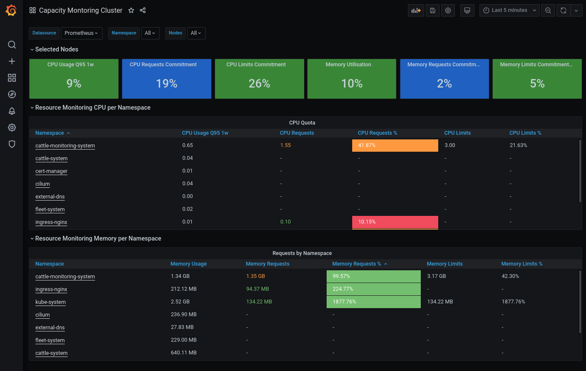
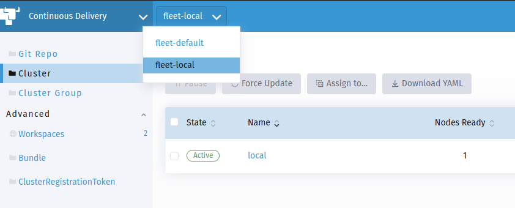
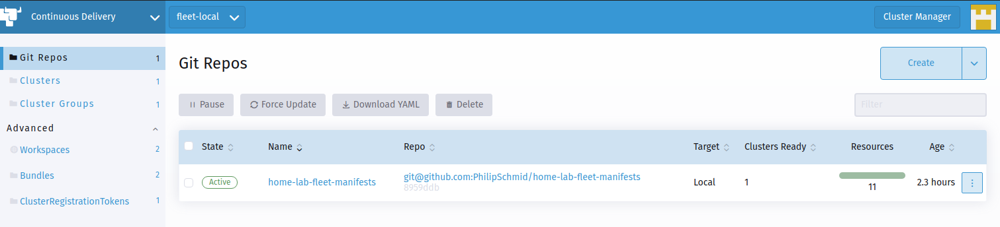

# Kubernetes in a Home Lab Environment
This repository should contain all required steps, manifests and resources to set up a K8s in a home lab environment. Its status should be viewed as "work in progress" since I plan to improve various things in the future.

In the end, I will probably run some applications on top of this technology stack, but the main goal is to strengthen my knowledge on different new (and sometimes fancy) cloud native and Kubernetes related tools. That's also the reason why this technology stack **should not be viewed as production ready**, since the chaining of the different tools and their configurations has not been tested really well.


# Technologies
The technologies down here will probably change in the future. Nevertheless, the following table should provide you a small overview over currently used technologies.

| What                   | Technology                                      | Status    |
| ---------------------- | ----------------------------------------------- | --------- |
| DNS Provider           | DigitalOcean (automated with External-DNS)      | Done      |
| OS (Intel NUC)         | Red Hat 8                                       | Done      |
| Distributon            | Rancher (RKE2)                                  | Done      |
| CRI                    | containerd (included in RKE2)                   | Done      |
| CNI                    | Cilium                                          | Done      |
| CSI                    | NFS SubDir External Provisioner                 | Done      |
| Certificate Handling   | Cert-Manager with Let's Encrypt (DNS Challenge) | Done      |
| Ingress Controller     | Nginx                                           | Done      |
| Control Plane          | Rancher 2.6                                     | Done      |
| Control Plane Backup   | Rancher Backups                                 | Done      |
| Monitoring             | Prometheus Stack via Rancher Monitoring         | Done      |
| Persistent Data Backup | Kanister                                        | On hold * |
| App Deployment         | Helm & Fleet                                    | Done      |
| Logging                | Grafana Loki (via Rancher Logging)              | On hold * |
| Container Registry     | Harbor                                          | On hold * |

`*` On hold since this feature is currently not needed.

# Table of Content
- [Kubernetes in a Home Lab Environment](#kubernetes-in-a-home-lab-environment)
- [Technologies](#technologies)
- [Table of Content](#table-of-content)
- [Hardware](#hardware)
- [Prerequisites](#prerequisites)
  - [Host OS](#host-os)
    - [Disable Swap](#disable-swap)
  - [Working Directory](#working-directory)
  - [Kubectl, Helm & RKE2](#kubectl-helm--rke2)
  - [VPN Remote Access to the Host via Wireguard (optional)](#vpn-remote-access-to-the-host-via-wireguard-optional)
- [K8s Cluster Setup](#k8s-cluster-setup)
  - [RKE2 Setup](#rke2-setup)
    - [Basic Configuration](#basic-configuration)
    - [Firewall](#firewall)
    - [Prevent RKE2 Package Updates](#prevent-rke2-package-updates)
  - [Starting RKE2](#starting-rke2)
  - [Configure Kubectl (on RKE2 Host)](#configure-kubectl-on-rke2-host)
- [Basic Infrastructure Components](#basic-infrastructure-components)
  - [Networking using Cilium (CNI)](#networking-using-cilium-cni)
    - [Cilium Prerequisites](#cilium-prerequisites)
    - [Cilium Installation](#cilium-installation)
  - [Persistent Storage using NFS-SubDir-External-Provisioner](#persistent-storage-using-nfs-subdir-external-provisioner)
    - [NFS-SubDir-External-Provisioner Prerequisites](#nfs-subdir-external-provisioner-prerequisites)
    - [NFS-SubDir-External-Provisioner Installation](#nfs-subdir-external-provisioner-installation)
- [Infrastructure related Components](#infrastructure-related-components)
  - [Deploy Nginx Ingress Controller](#deploy-nginx-ingress-controller)
    - [Nginx Ingress Controller Prerequisites](#nginx-ingress-controller-prerequisites)
    - [Nginx Ingress Controller Installation](#nginx-ingress-controller-installation)
  - [Cert-Manager](#cert-manager)
    - [Cert-Manager Prerequisites](#cert-manager-prerequisites)
    - [Cert-Manager Installation](#cert-manager-installation)
    - [Let's Encrypt DNS-Challenge DigitalOcean ClusterIssuer](#lets-encrypt-dns-challenge-digitalocean-clusterissuer)
  - [External-DNS](#external-dns)
    - [External-DNS Prerequisites](#external-dns-prerequisites)
    - [External-DNS Installation](#external-dns-installation)
  - [Rancher (2.6.X)](#rancher-26x)
    - [Rancher Prerequisites](#rancher-prerequisites)
    - [Rancher Installation](#rancher-installation)
    - [Rancher Backups](#rancher-backups)
      - [Rancher Backups Installation](#rancher-backups-installation)
    - [Rancher Monitoring](#rancher-monitoring)
      - [Cilium & Nginx Ingress Monitoring](#cilium--nginx-ingress-monitoring)
      - [Cilium Grafana Dashboards](#cilium-grafana-dashboards)
      - [Custom Nginx Ingress & Cluster Capacity Management Dashboard](#custom-nginx-ingress--cluster-capacity-management-dashboard)
  - [Logging with Loki](#logging-with-loki)
  - [Kanister Backup & Restore](#kanister-backup--restore)
  - [GitOps using Fleet](#gitops-using-fleet)
    - [Fleet Installation](#fleet-installation)
    - [Fleet Configuration](#fleet-configuration)
- [Application Components](#application-components)
  - [Minio Object Storage](#minio-object-storage)
  - [Harbor Registry](#harbor-registry)

# Hardware
One goal of this setup is that it should be runnable on a single host. The only exceptions are the external NFS storage from a Synology NAS and the DNS service from DigitalOcean.

In my case, I use an Intel NUC (`NUC10i7FNH2`) with a 12 core CPU (`Intel(R) Core(TM) i7-10710U CPU @ 1.10GHz`) and 64 GB memory (`2 x 32 GB DDR4-2666`).

# Prerequisites

## Host OS
Download and install Red Hat 8 server from https://developers.redhat.com/topics/linux. After creating a free developer account, you will be able to run 1 Red Hat enterprise server for free (development use only).

### Disable Swap
```
$ free -h
$ sudo swapoff -a
$ sed -i.bak -r 's/(.+ swap .+)/#\1/' /etc/fstab
$ free -h
```

## Working Directory
Create a working directory where e.g. Helm `values.yaml` files will be stored in the future:
```bash
$ mkdir ~/rke2
$ cd ~/rke2
```

## Kubectl, Helm & RKE2
Install `kubectl`, `helm` and RKE2 to the host system:
```bash
$ BINARY_DIR="/usr/local/bin"
$ cd /tmp
# Helm
$ wget https://get.helm.sh/helm-v3.7.1-linux-amd64.tar.gz
$ tar -zxvf helm-*-linux-amd64.tar.gz
$ sudo mv linux-amd64/helm $BINARY_DIR/helm
$ sudo chmod +x $BINARY_DIR/helm
# Kubectl
$ curl -LO "https://storage.googleapis.com/kubernetes-release/release/$(curl -s https://storage.googleapis.com/kubernetes-release/release/stable.txt)/bin/linux/amd64/kubectl"
$ chmod +x ./kubectl
$ sudo mv ./kubectl $BINARY_DIR/kubectl
$ sudo dnf install bash-completion
$ echo 'alias k="kubectl"' >>~/.bashrc
$ echo 'alias kgp="kubectl get pods"' >>~/.bashrc
$ echo 'alias kgn="kubectl get nodes"' >>~/.bashrc
$ echo 'alias kga="kubectl get all -A"' >>~/.bashrc
$ echo 'source <(kubectl completion bash)' >>~/.bashrc
$ echo 'complete -F __start_kubectl k' >>~/.bashrc
$ source ~/.bashrc
# RKE2
$ curl -sfL https://get.rke2.io | sudo sh -
```

Verification:
```bash
# Helm
$ helm version
version.BuildInfo{Version:"v3.7.1", GitCommit:"1d11fcb5d3f3bf00dbe6fe31b8412839a96b3dc4", GitTreeState:"clean", GoVersion:"go1.16.9"}
# Kubectl
$ kubectl version --client=true
Client Version: version.Info{Major:"1", Minor:"22", GitVersion:"v1.22.2", GitCommit:"8b5a19147530eaac9476b0ab82980b4088bbc1b2", GitTreeState:"clean", BuildDate:"2021-09-15T21:38:50Z", GoVersion:"go1.16.8", Compiler:"gc", Platform:"linux/amd64"}
# RKE2
$ rke2 --version
rke2 version v1.21.5+rke2r2 (9e4acdc6018ae74c36523c99af25ab861f3884da)
go version go1.16.6b7
```

Sources:
- https://helm.sh/docs/intro/install/
- https://kubernetes.io/docs/tasks/tools/install-kubectl/#install-kubectl-on-linux
- https://docs.rke2.io/install/methods/#rpm
- https://kubernetes.io/docs/tasks/tools/install-kubectl/#optional-kubectl-configurations

## VPN Remote Access to the Host via Wireguard (optional)
See https://gist.github.com/PhilipSchmid/b2ac0774fa99ec1286d63d2307a570a3 for more information.

# K8s Cluster Setup
## RKE2 Setup

### Basic Configuration
Create a RKE2 config file (`/etc/rancher/rke2/config.yaml`) with the following content:
```yaml
write-kubeconfig-mode: "0644"
tls-san:
  - "k8s.example.com"
# Make a etcd snapshot every 6 hours
etcd-snapshot-schedule-cron: " */6 * * *"
# Keep 56 etcd snapshorts (equals to 2 weeks with 6 a day)
etcd-snapshot-retention: 56
cni: "none"
disable-kube-proxy: "true"
disable:
  - rke2-ingress-nginx
```

**Note:** I set `disable-kube-proxy` to `true` and `cni` to `none`, since I plan to install Cilium as CNI in ["kube-proxy less mode"](https://docs.cilium.io/en/stable/gettingstarted/kubeproxy-free/) (`kubeProxyReplacement: "strict"`). Do not disable kube-proxy if you use another CNI - it will not work afterwards! I also disabled `rke2-ingress-nginx` since I wanted to install and configure the Nginx Ingress Controller according to my taste (Daemonset in host network namespace). Please also note that you'll need this same configuration on every single master node when you set up a multi-node cluster.

### Firewall
Ensure to open the required ports:
```bash
### RKE2 specific ports
$ sudo firewall-cmd --add-port=9345/tcp --permanent
$ sudo firewall-cmd --add-port=6443/tcp --permanent
$ sudo firewall-cmd --add-port=10250/tcp --permanent
$ sudo firewall-cmd --add-port=2379/tcp --permanent
$ sudo firewall-cmd --add-port=2380/tcp --permanent
$ sudo firewall-cmd --add-port=30000-32767/tcp --permanent
# Used for the Rancher Monitoring
$ sudo firewall-cmd --add-port=9796/tcp --permanent
$ sudo firewall-cmd --add-port=19090/tcp --permanent
$ sudo firewall-cmd --add-port=6942/tcp --permanent
$ sudo firewall-cmd --add-port=9091/tcp --permanent
### CNI specific ports
# 4244/TCP is required when the Hubble Relay is enabled and therefore needs to connect to all agents to collect the flows
$ sudo firewall-cmd --add-port=4244/tcp --permanent
# Cilium healthcheck related permits:
$ sudo firewall-cmd --add-port=4240/tcp --permanent
$ sudo firewall-cmd --remove-icmp-block=echo-request --permanent
$ sudo firewall-cmd --remove-icmp-block=echo-reply --permanent
# Since we are using Cilium with GENEVE as overlay, we need the following port too:
$ sudo firewall-cmd --add-port=6081/udp --permanent
### Ingress Controller specific ports
$ sudo firewall-cmd --add-port=80/tcp --permanent
$ sudo firewall-cmd --add-port=443/tcp --permanent
$ sudo firewall-cmd --add-port=10254/tcp --permanent
### Finally apply all the firewall changes
$ sudo firewall-cmd --reload
```

Verification:
```bash
$ sudo firewall-cmd --list-all
public (active)
  target: default
  icmp-block-inversion: no
  interfaces: eno1
  sources: 
  services: cockpit dhcpv6-client ssh wireguard
  ports: 9345/tcp 6443/tcp 10250/tcp 2379/tcp 2380/tcp 30000-32767/tcp 4240/tcp 6081/udp 80/tcp 443/tcp 4244/tcp 9796/tcp 19090/tcp 6942/tcp 9091/tcp
  protocols: 
  masquerade: yes
  forward-ports: 
  source-ports: 
  icmp-blocks: 
  rich rules: 
```

Source:
- https://docs.rke2.io/install/requirements/#networking

### Prevent RKE2 Package Updates
To provide more stability, I chose to DNF/YUM "mark/hold" the RKE2 related packages so a `dnf update`/`yum update` does not mess around with them.

Add the following line to `/etc/dnf/dnf.conf` and/or `/etc/yum.conf`:
```bash
exclude=rke2-*
```

This will cause the following packages to be kept back at this exact version as long as the `exclude` configuration is in place:
```bash
$ sudo rpm -qa "*rke2*"
rke2-server-1.21.5~rke2r2-0.el8.x86_64
rke2-common-1.21.5~rke2r2-0.el8.x86_64
rke2-selinux-0.8-2.el8.noarch
```

Sources:
- https://www.systutorials.com/making-dnf-yum-not-update-certain-packages/
- https://www.commandlinefu.com/commands/view/1451/search-through-all-installed-packages-names-on-rpm-systems

## Starting RKE2
Enable the `rke2-server` service and start it:
```bash
$ sudo systemctl enable rke2-server --now
```

Verification:
```bash
$ sudo systemctl status rke2-server
$ sudo journalctl -u rke2-server -f
```

## Configure Kubectl (on RKE2 Host)
```bash
$ mkdir ~/.kube
$ cp /etc/rancher/rke2/rke2.yaml ~/.kube/config
$ chmod 600 ~/.kube/config
```

Verification:
```bash
$ kubectl get nodes
NAME                    STATUS   ROLES         AGE     VERSION
node1.example.com   Ready    etcd,master   5m13s   v1.21.5+rke2r2
```

# Basic Infrastructure Components

## Networking using Cilium (CNI)

### Cilium Prerequisites

Ensure the eBFP file system is mounted (which should already be the case on RHEL 8.3):
```bash
$ mount | grep /sys/fs/bpf
# if present should output, e.g. "none on /sys/fs/bpf type bpf"...
```

If that's not the case, mount it using the commands down here:
```bash
$ sudo mount bpffs -t bpf /sys/fs/bpf
$ sudo bash -c 'cat <<EOF >> /etc/fstab
none /sys/fs/bpf bpf rw,relatime 0 0
EOF'
```

Prepare & add the Helm chart repo:
```bash
$ cd ~/rke2
$ mkdir cilium
$ helm repo add cilium https://helm.cilium.io/
$ helm repo update
```

Sources:
- https://docs.cilium.io/en/stable/operations/system_requirements/#mounted-ebpf-filesystem

### Cilium Installation
Create a `values.yaml` file with the following configuration:
```yaml
# Set kubeProxyReplacement to "strict" in order to prevent CVE-2020-8554 and fully remove kube-proxy.
# See https://cilium.io/blog/2020/12/11/kube-proxy-free-cve-mitigation for more information.
kubeProxyReplacement: "strict"

# The following two "k8sService.*" properties are required when Cilium is configured to fully replace kube-proxy since otherways it tries to reach the kube-apiserver on startup via the Service IP which does of course does not work without kube-proxy (iptables rules).
k8sServiceHost: <node-ip-of-node-where-kube-apiserver-is-running>
k8sServicePort: 6443

tunnel: "geneve"

hubble:
  enabled: true

  listenAddress: ":4244"

  metrics:
    # Configure this serviceMonitor section AFTER Rancher Monitoring is enabled!
    # Currently fails in Cilium 1.9.1 (https://github.com/cilium/cilium/pull/14473)
    #serviceMonitor:
    #  enabled: true
    enabled:
    - dns:query;ignoreAAAA
    - drop
    - tcp
    - flow
    - icmp
    - http

  ui:
    enabled: true
    replicas: 1
    ingress:
      enabled: true
      hosts:
        - hubble.example.com
      annotations:
        cert-manager.io/cluster-issuer: lets-encrypt-dns01-production-do
      tls:
      - secretName: letsencrypt-hubble-ui
        hosts:
        - hubble.example.com 

  relay:
    enabled: true

ipv6:
  enabled: true

# Since we only have 1 node, we only need 1 replica:
operator:
  replicas: 1
  # Configure this prometheus section AFTER Rancher Monitoring is enabled!
  #prometheus:
  #  enabled: true
  #  port: 6942
  #  serviceMonitor:
  #    enabled: true

ipam:
  mode: "cluster-pool"
  operator:
    clusterPoolIPv4PodCIDR: "10.42.0.0/16"
    clusterPoolIPv4MaskSize: 24
    clusterPoolIPv6PodCIDR: "fd00::/104"
    clusterPoolIPv6MaskSize: 120

prometheus:
  enabled: true
  # Default port value (9090) needs to be changed since the RHEL cockpit also listens on this port.
  port: 19090
  # Configure this serviceMonitor section AFTER Rancher Monitoring is enabled!
  #serviceMonitor:
  #  enabled: true
```
**Note:** Check the official [cilium/values.yaml](https://github.com/cilium/cilium/blob/master/install/kubernetes/cilium/values.yaml) in order to see all available values.

Finally install the Cilium helm chart:
```bash
$ helm upgrade -i --create-namespace --atomic cilium cilium/cilium \
  --version 1.10.5 \
  --namespace cilium \
  -f values.yaml
```

Sources:
- https://docs.cilium.io/en/stable/gettingstarted/k8s-install-default/
- https://docs.cilium.io/en/stable/gettingstarted/k8s-install-etcd-operator/
- https://docs.cilium.io/en/stable/gettingstarted/kubeproxy-free/

## Persistent Storage using NFS-SubDir-External-Provisioner
Used to provide persistent storage via NFS from the Synology NAS. It creates subdirectories for every Persistent Volume created on the K8s cluster (name schema: `${namespace}-${pvcName}-${pvName}`).

Sources:
- https://github.com/kubernetes-sigs/nfs-subdir-external-provisioner

### NFS-SubDir-External-Provisioner Prerequisites
Prepare & add the Helm chart repo:
```bash
$ mkdir ~/rke2/nfs-subdir-external-provisioner
$ helm repo add nfs-subdir-external-provisioner https://kubernetes-sigs.github.io/nfs-subdir-external-provisioner/
$ helm repo update
```

### NFS-SubDir-External-Provisioner Installation
Create a `values.yaml` file with the following configuration:
```yaml
nfs:
  server: <nfs-server-ip-here>
  path: /volume1/nfs

storageClass:
  create: true
  defaultClass: true
  name: nfs
  accessModes: ReadWriteMany
```

Finally, install the NFS SubDir external provisioner helm chart:
```bash
$ helm upgrade -i --create-namespace --atomic nfs-subdir-external-provisioner nfs-subdir-external-provisioner/nfs-subdir-external-provisioner \
  --version 4.0.14 \
  --namespace nfs-subdir-provisioner \
  -f values.yaml
```

Sources:
- https://github.com/kubernetes-sigs/nfs-subdir-external-provisioner/tree/master/charts/nfs-subdir-external-provisioner

# Infrastructure related Components

## Deploy Nginx Ingress Controller
The Nginx ingress controller is deployed as Daemonset within the host network namespace. This way the Nginx ingress controller can see the actual client IP where this would not be possible without any workarounds when the Nginx ingress controller would be deployed as Deployment outside the host's network namespace.

### Nginx Ingress Controller Prerequisites
Prepare & add the Helm chart repo:
```bash
$ mkdir ~/rke2/ingress-nginx
$ helm repo add ingress-nginx https://kubernetes.github.io/ingress-nginx
$ helm repo update
```

### Nginx Ingress Controller Installation
Create a `values.yaml` file with the following configuration:
```yaml
controller:
  dnsPolicy: ClusterFirstWithHostNet
  hostNetwork: true
  kind: "DaemonSet"

  watchIngressWithoutClass: true

  publishService:
    enabled: false
  
  service:
    enabled: true
    type: ClusterIP

  metrics:
    enabled: true
    # Configure this serviceMonitor section AFTER Rancher Monitoring is enabled!
    #serviceMonitor:
    #  enabled: true
    
  podSecurityPolicy:
    enabled: true

  serviceAccount:
    create: true

  admissionWebhooks:
    enabled: false
```

Finally, install the Nginx ingress controller helm chart:
```bash
$ helm upgrade -i --create-namespace --atomic nginx ingress-nginx/ingress-nginx \
  --version 4.0.6 \
  --namespace ingress-nginx \
  -f values.yaml
```

Sources:
- https://kubernetes.github.io/ingress-nginx/deploy/#using-helm
- https://github.com/kubernetes/ingress-nginx/tree/master/charts/ingress-nginx
- https://github.com/kubernetes/ingress-nginx/tree/helm-chart-4.0.6/charts/ingress-nginx

## Cert-Manager

### Cert-Manager Prerequisites
Prepare & add the Helm chart repo:
```bash
$ helm repo add jetstack https://charts.jetstack.io
$ helm repo update
```

### Cert-Manager Installation
Install the Cert-Manager controller helm chart:
```bash
$ helm upgrade -i --create-namespace --atomic cert-manager jetstack/cert-manager \
  --namespace cert-manager \
  --set installCRDs=true \
  --version v1.5.4
```

Verification:
```bash
$ kubectl get pods --namespace cert-manager
NAME                                       READY   STATUS    RESTARTS   AGE
cert-manager-74f46787b6-548rg              1/1     Running   0          78s
cert-manager-cainjector-748dc889c5-qhlqf   1/1     Running   0          78s
cert-manager-webhook-5b679f47d6-8ddcl      1/1     Running   0          78s
```

Sources:
- https://cert-manager.io/docs/installation/kubernetes/#installing-with-helm

### Let's Encrypt DNS-Challenge DigitalOcean ClusterIssuer
Create a Cert-Manager ClusterIssuer, which can issue Let's Encrypt certificates using the DNS01 challenge via DigitalOcean.

```bash
$ mkdir ~/rke2/cert-manager
$ touch lets-encrypt-dns01-do.yaml
```

Paste the following YAML into `lets-encrypt-dns01-do.yaml`:
```yaml
---
apiVersion: v1
kind: Secret
metadata:
  name: digitalocean-dns
  namespace: cert-manager
data:
  access-token: "base64 encoded access-token here"
---
apiVersion: cert-manager.io/v1
kind: ClusterIssuer
metadata:
  name: lets-encrypt-dns01-staging-do
spec:
  acme:
    email: me@example.com
    server: https://acme-staging-v02.api.letsencrypt.org/directory
    privateKeySecretRef:
      name: letsencrypt-stag
    solvers:
    - dns01:
        digitalocean:
          tokenSecretRef:
            name: digitalocean-dns
            key: access-token
---
apiVersion: cert-manager.io/v1
kind: ClusterIssuer
metadata:
  name: lets-encrypt-dns01-production-do
spec:
  acme:
    email: me@example.com
    server: https://acme-v02.api.letsencrypt.org/directory
    privateKeySecretRef:
      name: letsencrypt-prod
    solvers:
    - dns01:
        digitalocean:
          tokenSecretRef:
            name: digitalocean-dns
            key: access-token
```

Apply the `lets-encrypt-dns01-do.yaml` manifest:
```bash
$ kubectl apply -f lets-encrypt-dns01-do.yaml
```

Sources:
- https://cert-manager.io/docs/configuration/acme/dns01/
- https://cert-manager.io/docs/configuration/acme/dns01/digitalocean/

## External-DNS
Used to automatically create new DNS A records for new Ingress objects (on DigitalOcean).

Sources:
- https://github.com/kubernetes-sigs/external-dns
- https://github.com/bitnami/charts/tree/master/bitnami/external-dns

### External-DNS Prerequisites
Prepare & add the Helm chart repo:

```bash
$ mkdir ~/rke2/external-dns
$ helm repo add bitnami https://charts.bitnami.com/bitnami
$ helm repo update
```

### External-DNS Installation
Create a `values.yaml` file with the following configuration:
```yaml
provider: digitalocean
domainFilters:
- "example.com"
digitalocean:
  apiToken: "access-token here"
```

Finally, install the External-DNS helm chart:
```bash
$ helm upgrade -i --create-namespace --atomic external-dns bitnami/external-dns \
  --version 5.4.13 \
  --namespace external-dns \
  -f values.yaml
```

Verification:
```bash
$ kubectl --namespace=external-dns get pods -l "app.kubernetes.io/name=external-dns,app.kubernetes.io/instance=external-dns"
```

## Rancher (2.6.X)

Sources:
- https://rancher.com/docs/rancher/v2.6/en/installation/install-rancher-on-k8s/

### Rancher Prerequisites
Prepare & add the Helm chart repo:

```bash
$ mkdir ~/rke2/rancher
$ helm repo add rancher-latest https://releases.rancher.com/server-charts/latest
$ helm repo update
```

### Rancher Installation
Create a `certificate.yaml` file to issue a Certificate manually:
```yaml
apiVersion: cert-manager.io/v1
kind: Certificate
metadata:
  name: tls-rancher-ingress
  namespace: cattle-system
spec:
  secretName: tls-rancher-ingress
  commonName: rancher.example.com
  dnsNames:
  - rancher.example.com
  issuerRef:
    name: lets-encrypt-dns01-production-do
    kind: ClusterIssuer
```

Apply and verify the Certificate:
```bash
$ kubectl create ns cattle-system
$ kubectl apply -f certificate.yaml 
certificate.cert-manager.io/tls-rancher-ingress created
# Wait a few seconds up to a few minutes
$ kubectl get certificate -n cattle-system
NAME                  READY   SECRET                AGE
tls-rancher-ingress   True    tls-rancher-ingress   2m18s
```

Create a `values.yaml` file with the following configuration:
```yaml
hostname: rancher.example.com
ingress:
  tls:
    source: secret
replicas: 1
auditLog:
  level: 1
```

Finally, install the Rancher helm chart:
```bash
$ helm upgrade -i --create-namespace --atomic rancher rancher-latest/rancher \
  --version 2.6.2 \
  --namespace cattle-system \
  -f values.yaml
```

Verification:
```bash
$ kubectl -n cattle-system rollout status deploy/rancher
Waiting for deployment "rancher" rollout to finish: 0 of 1 updated replicas are available...
deployment "rancher" successfully rolled out
```


Sources:
- https://rancher.com/docs/rancher/v2.6/en/installation/install-rancher-on-k8s/chart-options/
- https://github.com/rancher/rancher/issues/26850#issuecomment-658644922

### Rancher Backups
Rancher 2.5+ now comes with a [rancher-backup](https://github.com/rancher/charts/tree/main/charts/rancher-backup) which can backup/restore all K8s and CRD resources that Rancher creates and manages.
Backup target can be a Persistent Volume or a S3 bucket.

Sources:
- https://rancher.com/docs/rancher/v2.x/en/backups/v2.5/

#### Rancher Backups Installation
Select the `local` cluster, navigate to the "App & Marketplace" -> "Charts" menu and search for the "Rancher Backups" chart. Configure the settings down here:




Next, change the Rancher Backups PersistentVolume reclaim policy to `Retain` (since the `nfs-client` Storageclass uses `Delete` by default):

```bash
$ kubectl patch pv <rancher-backup-pv-name> -p '{"spec":{"persistentVolumeReclaimPolicy":"Retain"}}'
# E.g.:
$ kubectl patch pv pvc-bb7dea4c-f381-4b6c-92e3-9c62fb2e7b7a -p '{"spec":{"persistentVolumeReclaimPolicy":"Retain"}}'
```

Verification:
```bash
# Before
$ kubectl get pv
NAME                                       CAPACITY   ACCESS MODES   RECLAIM POLICY   STATUS   CLAIM                                                                                                             STORAGECLASS   REASON   AGE
pvc-bb7dea4c-f381-4b6c-92e3-9c62fb2e7b7a   10Gi       RWO            Delete           Bound    cattle-resources-system/rancher-backup-1                                                                          nfs                     29s
# Change Retention Policy
$ kubectl patch pv pvc-bb7dea4c-f381-4b6c-92e3-9c62fb2e7b7a -p '{"spec":{"persistentVolumeReclaimPolicy":"Retain"}}'
persistentvolume/pvc-bb7dea4c-f381-4b6c-92e3-9c62fb2e7b7a patched
# After
$ kubectl get pv
NAME                                       CAPACITY   ACCESS MODES   RECLAIM POLICY   STATUS   CLAIM                                                                                                             STORAGECLASS   REASON   AGE
pvc-bb7dea4c-f381-4b6c-92e3-9c62fb2e7b7a   10Gi       RWO            Retain           Bound    cattle-resources-system/rancher-backup-1                                                                          nfs                     56s
```

Finally, navigate to the "Rancher Backups" menu and configure a new scheduled backup job or simply create a new CR which does basically the same:

```yaml
apiVersion: resources.cattle.io/v1
kind: Backup
metadata:
  name: default-backup-all
  annotations:
    field.cattle.io/description: 'Backups everything every 2h (retention: 2 weeks)'
spec:
  encryptionConfigSecretName: 
  resourceSetName: rancher-resource-set
  retentionCount: 168
  schedule: 0 */2 * * *
```

More backup YAML examples can be found here: https://rancher.com/docs/rancher/v2.6/en/backups/configuration/backup-config/

Verification:


### Rancher Monitoring
Since the new Rancher 2.5+ monitoring is already based on the [kube-prometheus-stack](https://github.com/prometheus-community/helm-charts/tree/main/charts/kube-prometheus-stack) I will simply use it this way.

Navigate to the "App & Marketplace" -> "Charts" menu in Rancher and search for the "Monitoring" chart. Leave nearly all settings default but enable persistent storage for Prometheus:




Also click on `Edit as YAML` and search for the `rke2Proxy` section to disable it:
```yaml
rke2Proxy:
  enabled: false
```
(We simply can't use the kube-proxy metrics target since we disabled it completely ("kube-proxy less" Cilium).)

Finally, click "Install" and wait a few minutes.

**Hints:**
- Ensure to open `9796/TCP` on the node since the RKE2 deployed node-exporter provides the Rancher Monitoring metrics via this port.
- Ensure all Prometheus targets are healthy by navigating to "Monitoring" -> "Overview" -> "Prometheus Targets".
- If the Grafana pod does not come up properly, ensure your NFS share squash settings allow the Grafana init container to change the ownership of files/directories inside its NFS based PV.

Sources:
- https://rancher.com/docs/rancher/v2.6/en/monitoring-alerting/

#### Cilium & Nginx Ingress Monitoring
Since we now have deployed the Prometheus stack, we should be able to enable the Cilium & Nginx ingress monitoring, which are also based on the `ServiceMonitor` CRDs from the Prometheus stack. Add the following properties to the Cilium `values.yaml` file and redeploy it (keep all other values as shown before):

```yaml
hubble:
  metrics:
    serviceMonitor:
      enabled: true

operator:
  prometheus:
    enabled: true
    port: 6942
    serviceMonitor:
      enabled: true

prometheus:
  serviceMonitor:
    enabled: true
```

**Hint:** Ensure to open `19090/TCP`, `9091/TCP` and `6942/TCP` on the node since cilium exposes the Prometheus metrics on these ports.

Do the same with the Nginx ingress by changing the values down here:
```yaml
controller:
  metrics:
    serviceMonitor:
      enabled: true
```

#### Cilium Grafana Dashboards
There are currently 3 public available Grafana Dashboards from Cilium:

- [Cilium v1.9 Agent Metrics](https://grafana.com/grafana/dashboards/13537)
- [Cilium v1.9 Hubble Metrics](https://grafana.com/grafana/dashboards/13539)
- [Cilium v1.9 Operator Metrics](https://grafana.com/grafana/dashboards/13538)

Create a ConfigMap (`grafana-cilium-dashboards-cm.yaml`) with the following content and replace the `...` placeholders with the regarding dashboard JSONs from the links above:
```yaml
---
apiVersion: v1
kind: ConfigMap
metadata:
  labels:
    grafana_dashboard: "1"
  name: grafana-cilium-agent-metrics-cm
  namespace: cattle-dashboards
data:
  cilium-agent-metrics.json: |-
    ...
---
apiVersion: v1
kind: ConfigMap
metadata:
  labels:
    grafana_dashboard: "1"
  name: grafana-cilium-hubble-metrics-cm
  namespace: cattle-dashboards
data:
  cilium-hubble-metrics.json: |-
    ...
---
apiVersion: v1
kind: ConfigMap
metadata:
  labels:
    grafana_dashboard: "1"
  name: grafana-cilium-operator-metrics-cm
  namespace: cattle-dashboards
data:
  cilium-operator-metrics.json: |-
    ...
```

**Note**: The Grafana dashboards did not work right away. I needed to remove all `k8s_app=\"cilium\"`/`{io_cilium_app=\"operator\"}` constraints and I also needed to add `DS_PROMETHEUS` `templating` `list` objects. If you run into the same issues, just use the provided `manifests/grafana-cilium-dashboards-cm.yaml` manifest:

```bash
$ kubectl apply -f grafana-cilium-dashboards-cm.yaml
```


Sources:
- https://rancher.com/docs/rancher/v2.x/en/monitoring-alerting/v2.5/migrating/#migrating-grafana-dashboards

#### Custom Nginx Ingress & Cluster Capacity Management Dashboard
When installing the Prometheus stack, I also often deploy some other nice Grafana Dashboards like this one for the Nginx ingress:



.. or this one for the cluster capacity management:



If you want these dashboards too, just use the provided manifests:

```bash
$ kubectl apply -f manifests/nginx-dashboard.yaml
$ kubectl apply -f manifests/capacity-monitoring-dashboard.yaml
```

## Logging with Loki
TODO

## Kanister Backup & Restore
TODO

## GitOps using Fleet
I first wanted to use ArgoCD to deploy applications with the GitOps approach on the K8s cluster, but then I realized, Rancher 2.5+ already comes with Fleet preinstalled and that it also offers a quite nice UI integration. I therefore chose to give Fleet a try.

Sources:
- https://rancher.com/docs/rancher/v2.x/en/deploy-across-clusters/fleet
- https://fleet.rancher.io/
- https://github.com/rancher/fleet-examples/

### Fleet Installation
No Fleet installation is required since Rancher 2.5+ already installed this app inside the `fleet-system` namespace.

Verification:
```bash
$ kubectl -n fleet-system logs -l app=fleet-controller
<output truncated>
time="2020-12-28T12:45:34Z" level=info msg="Cluster registration fleet-local/request-w8hv7, cluster fleet-local/local granted [true]"
$ kubectl -n fleet-system get pods -l app=fleet-controller
NAME                                READY   STATUS    RESTARTS   AGE
fleet-controller-767b564d9f-fshp6   1/1     Running   0          2m35s
```

### Fleet Configuration
To manage the RKE2 `local` cluster, you need to switch to the `fleet-local` namespace as the `local` cluster should already be added there since Rancher 2.5+ automatically deployed a fleet-agent in it:

```bash
$ kubectl get clusters.fleet.cattle.io -A
NAMESPACE     NAME    BUNDLES-READY   NODES-READY   SAMPLE-NODE             LAST-SEEN              STATUS
fleet-local   local   1/1             1/1           node1.example.com   2020-12-28T12:45:52Z
```



The final fleet basic configuration step is to add a Git repository, which is later used to store the Fleet managed manifests. I chose to also host this on Github inside the private https://github.com/PhilipSchmid/home-lab-fleet-manifests repository.

To allow Fleet to access a private Git repository, you must create a SSH key, which is then added as the deployment key. More information about this process can be found here: https://fleet.rancher.io/gitrepo-add/

```bash
$ mkdir ~/rke2/fleet
$ cd ~/rke2/fleet

$ ssh-keygen -t rsa -b 4096 -m pem -C "Fleet" -f fleet_id_rsa
$ ssh-keyscan -H github.com 2>/dev/null > github_knownhost

$ kubectl create secret generic fleet-github-ssh-key \
  -n fleet-local \
  --from-file=ssh-privatekey=fleet_id_rsa \
  --from-file=known_hosts=github_knownhost \
  --type=kubernetes.io/ssh-auth 
```

Do not forget to add the just generated public key as deploy key on the Github Git repository (read permissions should be sufficient)

Finally, it's time to configure the GitRepo CR (`home-lab-fleet-manifests.yaml`):
```yaml
apiVersion: fleet.cattle.io/v1alpha1
kind: GitRepo
metadata:
  name: home-lab-fleet-manifests
  namespace: fleet-local
spec:
  repo: git@github.com:PhilipSchmid/home-lab-fleet-manifests.git
  clientSecretName: fleet-github-ssh-key
  paths:
  - /minio
  - /harbor
```

```bash
$ kubectl apply -f home-lab-fleet-manifests.yaml
```

Sources:
- https://fleet.rancher.io/gitrepo-add/

# Application Components
Deployed via GitOps (Fleet).

Sources:
- https://fleet.rancher.io/gitrepo-structure/

## Minio Object Storage
Create a `minio/fleet.yaml` file inside the `home-lab-fleet-manifests` Git repository:

```yaml
defaultNamespace: fleet-app-minio
helm:
  chart: minio
  repo: https://helm.min.io/
  releaseName: minio
  version: 8.0.8
  values:
    ingress: 
      enabled: "true"
      hosts:
      - minio.example.com
      tls:
      - hosts:
        - minio.example.com
      annotations:
        nginx.ingress.kubernetes.io/proxy-body-size: 5G
        cert-manager.io/cluster-issuer: lets-encrypt-dns01-production-do
    persistence: 
      size: "100Gi"
      storageClass: "nfs-client"
      accessMode: ReadWriteMany
    metrics:
      serviceMonitor:
        enabled: true
diff:
  comparePatches:
  - apiVersion: networking.k8s.io/v1beta1
    kind: Ingress
    name: minio
    namespace: fleet-app-minio
    operations:
    - {"op":"remove", "path":"/spec/rules/0/http/paths"}
```

**Note:** The `diff.comparePatches` section is required since Fleet would otherwise recognize the Minio Helm chart created Ingress object as `modified` all the time. Error: `Modified(1) [Cluster fleet-local/local]; ingress.networking.k8s.io fleet-app-minio/minio modified {"spec":{"rules":[{"host":"minio.example.com","http":{"paths":[{"backend":{"serviceName":"minio","servicePort":9000},"path":"/"}]}}]}}`

Finally, push this `fleet.yaml` file to the repositories `master` branch. Fleet should then automatically start to deploy the Minio application via the specified Helm chart.



To get the Minio secret and access key, issue the following commands:
```bash
$ kubectl get secret -n fleet-app-minio minio -o jsonpath='{.data.accesskey}' | base64 -d
$ kubectl get secret -n fleet-app-minio minio -o jsonpath='{.data.secretkey}' | base64 -d
```

Sources:
- https://github.com/minio/charts
- https://github.com/minio/charts#existing-secret
- https://github.com/rancher/fleet-examples/blob/c6e54d7a56565e52a63de8a2088997b46253c1fb/single-cluster/helm-multi-chart/rancher-monitoring/fleet.yaml#L6

## Harbor Registry
TODO