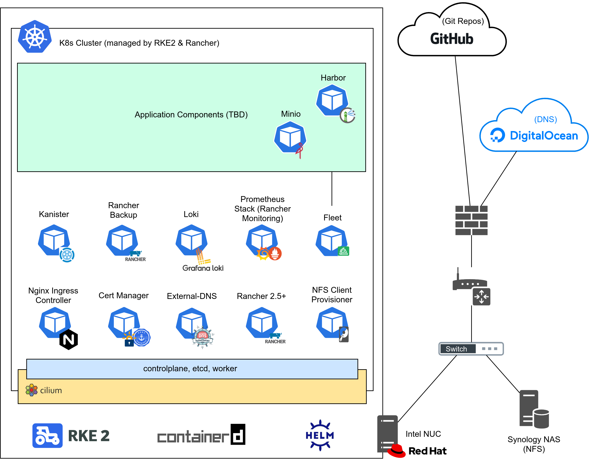

# K8s Home Lab
This repository should contain all required steps, manifests and resources to set up a K8s in a home lab environment. Its status should be viewed as "work in progress" since I plan to improve various things in the future.

# Technologies
Currently there's only a rough plan about which technologies should be used for this setup. The table down here will definitely change as soon as the project progresses.

| What | Technology |
|---|---|
| DNS Provider | DigitalOcean |
| OS (Intel NUC) | Red Hat 8 |
| Distributon | Rancher (RKE2) |
| CRI | containerd (included in RKE2) |
| CNI | Cilium |
| CSI | NFS-Client Provisioner |
| Certificate Handling | Cert-Manager with Let's Encrypt (DNS Challenge) |
| Ingress Controller | Nginx |
| Data Backup | Kanister |
| App Deployment | Helm & mostly ArgoCD |
| Logging | Grafana Loki (via Rancher Logging) |
| Registry | Harbor |

# Table of Content
- [K8s Home Lab](#k8s-home-lab)
- [Technologies](#technologies)
- [Table of Content](#table-of-content)
- [Hardware](#hardware)
- [Topology](#topology)
- [Prerequisites](#prerequisites)
  - [Host OS](#host-os)
    - [Disable Swap](#disable-swap)
  - [Working Directory](#working-directory)
  - [Kubectl, Helm & RKE2](#kubectl-helm--rke2)
  - [VPN Remote Access to the Host via Wireguard (optional)](#vpn-remote-access-to-the-host-via-wireguard-optional)
- [K8s Cluster Setup](#k8s-cluster-setup)
  - [RKE2 Setup](#rke2-setup)
    - [Basic Configuration](#basic-configuration)
    - [Firewall](#firewall)
  - [Starting RKE2](#starting-rke2)
  - [Configure Kubectl (on RKE2 Host)](#configure-kubectl-on-rke2-host)
- [Basic Infrastructure Components](#basic-infrastructure-components)
  - [Networking using Cilium (CNI)](#networking-using-cilium-cni)
    - [Cilium Prerequisites](#cilium-prerequisites)
    - [Cilium Installation](#cilium-installation)
  - [Persistent Storage using NFS-Client Provisioner](#persistent-storage-using-nfs-client-provisioner)
    - [NFS-Client Provisioner Prerequisites](#nfs-client-provisioner-prerequisites)
    - [NFS-Client Provisioner Installation](#nfs-client-provisioner-installation)
- [Infrastructure related Components](#infrastructure-related-components)
  - [Deploy Nginx Ingress Controller](#deploy-nginx-ingress-controller)
    - [Nginx Ingress Controller Prerequisites](#nginx-ingress-controller-prerequisites)
    - [Nginx Ingress Controller Installation](#nginx-ingress-controller-installation)
  - [Cert-Manager](#cert-manager)
    - [Cert-Manager Prerequisites](#cert-manager-prerequisites)
    - [Cert-Manager Installation](#cert-manager-installation)
    - [Let's Encrypt DNS-Challenge DigitalOcean ClusterIssuer](#lets-encrypt-dns-challenge-digitalocean-clusterissuer)
  - [External-DNS](#external-dns)
    - [External-DNS Prerequisites](#external-dns-prerequisites)
    - [External-DNS Installation](#external-dns-installation)
  - [Prometheus Monitoring](#prometheus-monitoring)
  - [Logging with Loki](#logging-with-loki)
  - [Kanister Backup & Restore](#kanister-backup--restore)
  - [GitOps using ArgoCD](#gitops-using-argocd)
  - [Deploy Kubernetes Dashboard](#deploy-kubernetes-dashboard)
- [Application Components](#application-components)
  - [Harbor Registry](#harbor-registry)
- [Optional Components](#optional-components)
  - [Secret replication using Emberstack Reflector](#secret-replication-using-emberstack-reflector)

# Hardware
One goal of this setup is that it should be runnable on a single host. The only exceptions are the external NFS storage from a Synology NAS and the DNS/S3/storage service from DigitalOcean.

In my case I use an Intel NUC (`NUC10i7FNH2`) with a 12 core CPU (`Intel(R) Core(TM) i7-10710U CPU @ 1.10GHz`) and 64 GB memory (`2 x 32 GB DDR4-2666`).

# Topology


# Prerequisites

## Host OS
Download and install Red Hat 8 server from https://developers.redhat.com/topics/linux. After creating a free developer account, you will be able to run 1 Red Hat enterprise server for free (development use only).

### Disable Swap
```
free -h
sudo swapoff -a
sed -i.bak -r 's/(.+ swap .+)/#\1/' /etc/fstab
free -h
```

## Working Directory
Create a working directory where e.g. Helm `values.yaml` files will be stored in the future:
```bash
mkdir ~/rke2
cd ~/rke2
```

## Kubectl, Helm & RKE2
Install `kubectl`, `helm` and RKE2 to the host system:
```bash
BINARY_DIR="/usr/local/bin"
cd /tmp
# Helm
wget https://get.helm.sh/helm-v3.4.2-linux-amd64.tar.gz
tar -zxvf helm-*-linux-amd64.tar.gz
sudo mv linux-amd64/helm $BINARY_DIR/helm
sudo chmod +x $BINARY_DIR/helm
# Kubectl
curl -LO "https://storage.googleapis.com/kubernetes-release/release/$(curl -s https://storage.googleapis.com/kubernetes-release/release/stable.txt)/bin/linux/amd64/kubectl"
chmod +x ./kubectl
sudo mv ./kubectl /usr/local/bin/kubectl
sudo dnf install bash-completion
echo 'alias k="kubectl"' >>~/.bashrc
echo 'alias kgp="kubectl get pods"' >>~/.bashrc
echo 'alias kgn="kubectl get nodes"' >>~/.bashrc
echo 'alias kga="kubectl get all -A"' >>~/.bashrc
echo 'source <(kubectl completion bash)' >>~/.bashrc
echo 'complete -F __start_kubectl k' >>~/.bashrc
source ~/.bashrc
# RKE2
curl -sfL https://get.rke2.io | sudo sh -
```

Verification:
```bash
# Helm
[user@commander tmp]$ helm version
version.BuildInfo{Version:"v3.4.2", GitCommit:"23dd3af5e19a02d4f4baa5b2f242645a1a3af629", GitTreeState:"clean", GoVersion:"go1.14.13"}
# Kubectl
[user@commander tmp]$ kubectl version client
Client Version: version.Info{Major:"1", Minor:"20", GitVersion:"v1.20.1", GitCommit:"c4d752765b3bbac2237bf87cf0b1c2e307844666", GitTreeState:"clean", BuildDate:"2020-12-18T12:09:25Z", GoVersion:"go1.15.5", Compiler:"gc", Platform:"linux/amd64"}
The connection to the server localhost:8080 was refused - did you specify the right host or port?
# RKE2
[user@commander tmp]$ rke2 --version
rke2 version v1.18.13+rke2r1 (328b72961434301ade71381ce94b23b178c40736)
go version go1.13.15b4
```

Sources:
- https://helm.sh/docs/intro/install/
- https://kubernetes.io/docs/tasks/tools/install-kubectl/#install-kubectl-on-linux
- https://docs.rke2.io/install/methods/#rpm
- https://kubernetes.io/docs/tasks/tools/install-kubectl/#optional-kubectl-configurations

## VPN Remote Access to the Host via Wireguard (optional)
See https://gist.github.com/PhilipSchmid/b2ac0774fa99ec1286d63d2307a570a3 for more information.

# K8s Cluster Setup
## RKE2 Setup

### Basic Configuration
Create a RKE2 config file (`/etc/rancher/rke2/config.yaml`) with the following content:
```yaml
write-kubeconfig-mode: "0644"
tls-san:
  - "k8s.0x707363.ch"
# Make a etcd snapshot every 6 hours
etcd-snapshot-schedule-cron: " */6 * * *"
# Keep 56 etcd snapshorts (equals to 2 weeks with 6 a day)
etcd-snapshot-retention: 56
disable:
  - rke2-canal
  - rke2-ingress-nginx
```

### Firewall
Ensure to open the required ports:
```bash
### RKE2 specific ports
sudo firewall-cmd --add-port=9345/tcp --permanent
sudo firewall-cmd --add-port=6443/tcp --permanent
sudo firewall-cmd --add-port=10250/tcp --permanent
sudo firewall-cmd --add-port=2379/tcp --permanent
sudo firewall-cmd --add-port=2380/tcp --permanent
sudo firewall-cmd --add-port=30000-32767/tcp --permanent
### CNI specific ports
# 4244/TCP is required when the Hubble Relay is enabled and therefore needs to connect to all agents to collect the flows
sudo firewall-cmd --add-port=4244/tcp --permanent
# Cilium healthcheck related permits:
sudo firewall-cmd --add-port=4240/tcp --permanent
sudo firewall-cmd --remove-icmp-block=echo-request --permanent
sudo firewall-cmd --remove-icmp-block=echo-reply --permanent
# Since we are using Cilium with GENEVE as overlay, we need the following port too:
sudo firewall-cmd --add-port=6081/udp --permanent
### Ingress Controller specific ports
sudo firewall-cmd --add-port=80/tcp --permanent
sudo firewall-cmd --add-port=443/tcp --permanent

### Finally apply all the firewall changes
sudo firewall-cmd --reload
```

Verification:
```bash
[user@host tmp]$ sudo firewall-cmd --list-all
public (active)
  target: default
  icmp-block-inversion: no
  interfaces: eno1
  sources: 
  services: cockpit dhcpv6-client ssh wireguard
  ports: 9345/tcp 6443/tcp 10250/tcp 2379/tcp 2380/tcp 30000-32767/tcp 4240/tcp 6081/udp 80/tcp 443/tcp 4244/tcp
  protocols: 
  masquerade: yes
  forward-ports: 
  source-ports: 
  icmp-blocks: 
  rich rules:
```

Source:
- https://docs.rke2.io/install/requirements/#networking


## Starting RKE2
Enable the `rke2-server` service and start it:
```bash
sudo systemctl enable rke2-server --now
```

Verification:
```bash
[user@commander tmp]$ sudo systemctl status rke2-server
[user@commander tmp]$ sudo journalctl -u rke2-server -f
```

## Configure Kubectl (on RKE2 Host)
```bash
mkdir ~/.kube
cp /etc/rancher/rke2/rke2.yaml ~/.kube/config
chmod 600 ~/.kube/config
```

Verification:
```bash
[user@commander tmp]$ kubectl get nodes
NAME                    STATUS   ROLES         AGE     VERSION
commander.0x707363.ch   Ready    etcd,master   5m13s   v1.18.13+rke2r1
```

# Basic Infrastructure Components

## Networking using Cilium (CNI)

### Cilium Prerequisites

Ensure the eBFP filesystem is mounted (which should already be the case on RHEL 8.3):
```
mount | grep /sys/fs/bpf
# if present should output, e.g. "none on /sys/fs/bpf type bpf"...
```

If that's not the case, mount it using the commands down here:
```bash
sudo mount bpffs -t bpf /sys/fs/bpf
sudo bash -c 'cat <<EOF >> /etc/fstab
none /sys/fs/bpf bpf rw,relatime 0 0
EOF'
```

Prepare & add the Helm chart repo:
```bash
cd ~/rke2
mkdir cilium
helm repo add cilium https://helm.cilium.io/
helm repo update
```

Sources:
- https://docs.cilium.io/en/stable/operations/system_requirements/#mounted-ebpf-filesystem

### Cilium Installation
Create a `values.yaml` file with the following configuration:
```yaml
hubble:
  enabled: true

  listenAddress: ":4244"

  metrics:
    enabled:
    - dns:query;ignoreAAAA
    - drop
    - tcp
    - flow
    - icmp
    - http

  ui:
    enabled: true
    ingress:
      enabled: true
      hosts:
        - hubble.0x707363.ch
      annotations:
        cert-manager.io/cluster-issuer: lets-encrypt-dns01-production-do
      tls:
      - secretName: letsencrypt-hubble-ui
        hosts:
        - hubble.0x707363.ch 

  relay:
    enabled: true

ipv6:
  enabled: true

# Since we only have 1 node, we only need 1 replica:
operator:
  replicas: 1

ipam:
  mode: "cluster-pool"
  operator:
    clusterPoolIPv4PodCIDR: "10.42.0.0/16"
    clusterPoolIPv4MaskSize: 24
    clusterPoolIPv6PodCIDR: "fd00::/104"
    clusterPoolIPv6MaskSize: 120

prometheus:
  enabled: true
  # Default port value (9090) needs to be changed since the RHEL cockpit also listens on this port.
  port: 19090
```
**Note:** Check the official [cilium/values.yaml](https://github.com/cilium/cilium/blob/master/install/kubernetes/cilium/values.yaml) in order to see all available values.

Finally install the Cilium helm chart:
```bash
helm upgrade -i --create-namespace --atomic cilium cilium/cilium \
  --version 1.9.1 \
  --namespace cilium \
  -f values.yaml
```

Sources:
- https://docs.cilium.io/en/stable/gettingstarted/k8s-install-default/
- https://docs.cilium.io/en/stable/gettingstarted/k8s-install-etcd-operator/

## Persistent Storage using NFS-Client Provisioner
Used to provide persistent storage via NFS from the Synology NAS. It creates sub directories for every Persistent Volume created on the K8s cluster (name schema: `${namespace}-${pvcName}-${pvName}`).

Sources:
- https://github.com/kubernetes-sigs/nfs-subdir-external-provisioner
- https://artifacthub.io/packages/helm/ckotzbauer/nfs-client-provisioner

### NFS-Client Provisioner Prerequisites
Since the official helm chart [repository is deprected](https://github.com/helm/charts#%EF%B8%8F-deprecation-and-archive-notice) and no official successor of the NFS-client provisioner Helm chart is provided, we simply use [ckotzbauer/nfs-client-provisioner](https://artifacthub.io/packages/helm/ckotzbauer/nfs-client-provisioner).

```bash
mkdir ~/rke2/nfs-client-provisioner
helm repo add ckotzbauer https://ckotzbauer.github.io/helm-charts
helm repo update
```

### NFS-Client Provisioner Installation
Create a `values.yaml` file with the following configuration:
```yaml
nfs:
  server: <nfs-server-ip-here>
  path: /volume1/nfs

storageClass:
  create: true
  defaultClass: true
  name: nfs-client
  accessModes: ReadWriteMany

podSecurityPolicy:
  enabled: true
```

Finally install the Nginx ingress controller helm chart:
```bash
helm upgrade -i --create-namespace --atomic nfs-client-provisioner ckotzbauer/nfs-client-provisioner \
  --version 1.0.2 \
  --namespace nfs-client \
  -f values.yaml
```

# Infrastructure related Components

## Deploy Nginx Ingress Controller
The Nginx ingress controller is deployed as Daemonset within the host network namespace. This way the Nginx ingress controller is able to see the actual client IP where this would not be possible without any workarounds when the Nginx ingress controller would be deployed as Deployment outside of the host's network namespace.

### Nginx Ingress Controller Prerequisites
Prepare & add the Helm chart repo:
```bash
mkdir ~/rke2/ingress-nginx
helm repo add ingress-nginx https://kubernetes.github.io/ingress-nginx
helm repo update
```

### Nginx Ingress Controller Installation
Create a `values.yaml` file with the following configuration:
```yaml
controller:
  dnsPolicy: ClusterFirstWithHostNet
  hostNetwork: true
  kind: "DaemonSet"

  publishService:
    enabled: false
  
  service:
    enabled: true
    type: ClusterIP

  metrics:
    enabled: true
    
  podSecurityPolicy:
    enabled: true

  serviceAccount:
    create: true

  admissionWebhooks:
    enabled: false
```

Finally install the Nginx ingress controller helm chart:
```bash
helm upgrade -i --create-namespace --atomic nginx ingress-nginx/ingress-nginx \
  --version 3.16.1 \
  --namespace ingress-nginx \
  -f values.yaml
```

Sources:
- https://kubernetes.github.io/ingress-nginx/deploy/#using-helm
- https://github.com/kubernetes/ingress-nginx/tree/master/charts/ingress-nginx
- https://github.com/kubernetes/ingress-nginx/blob/master/charts/ingress-nginx/values.yaml

## Cert-Manager

### Cert-Manager Prerequisites
Install the required CRDs:
```
kubectl apply -f https://github.com/jetstack/cert-manager/releases/download/v1.1.0/cert-manager.crds.yaml
```

Prepare & add the Helm chart repo:
```bash
helm repo add jetstack https://charts.jetstack.io
helm repo update
```

### Cert-Manager Installation
Install the Cert-Manager controller helm chart:
```bash
helm upgrade -i --create-namespace --atomic cert-manager jetstack/cert-manager \
  --namespace cert-manager \
  --version v1.1.0
```

Verification:
```bash
[user@commander rke2]$ kubectl get pods --namespace cert-manager
NAME                                       READY   STATUS    RESTARTS   AGE
cert-manager-5fd9d77768-nm72s              1/1     Running   0          14s
cert-manager-cainjector-78cbd59555-tk666   1/1     Running   0          14s
cert-manager-webhook-756d477cc4-8pj2l      1/1     Running   0          14s
```

Sources:
- https://cert-manager.io/docs/installation/kubernetes/#installing-with-helm

### Let's Encrypt DNS-Challenge DigitalOcean ClusterIssuer
Crete a Cert-Manager ClusterIssuer, which is able to issue Let's Encrypt certificates using the DNS01 challenge via DigitalOcean.

```bash
mkdir ~/rke2/cert-manager
touch lets-encrypt-dns01-do.yaml
```

Paste the following YAML into `lets-encrypt-dns01-do.yaml`:
```yaml
---
apiVersion: v1
kind: Secret
metadata:
  name: digitalocean-dns
  namespace: cert-manager
data:
  access-token: "base64 encoded access-token here"
---
apiVersion: cert-manager.io/v1
kind: ClusterIssuer
metadata:
  name: lets-encrypt-dns01-staging-do
spec:
  acme:
    email: me@0x707363.ch
    server: https://acme-staging-v02.api.letsencrypt.org/directory
    privateKeySecretRef:
      name: letsencrypt-stag
    solvers:
    - dns01:
        digitalocean:
          tokenSecretRef:
            name: digitalocean-dns
            key: access-token
---
apiVersion: cert-manager.io/v1
kind: ClusterIssuer
metadata:
  name: lets-encrypt-dns01-production-do
spec:
  acme:
    email: me@0x707363.ch
    server: https://acme-v02.api.letsencrypt.org/directory
    privateKeySecretRef:
      name: letsencrypt-prod
    solvers:
    - dns01:
        digitalocean:
          tokenSecretRef:
            name: digitalocean-dns
            key: access-token
```

Apply the `lets-encrypt-dns01-do.yaml` manifest:
```bash
kubectl apply -f lets-encrypt-dns01-do.yaml
```

Sources:
- https://cert-manager.io/docs/configuration/acme/dns01/
- https://cert-manager.io/docs/configuration/acme/dns01/digitalocean/

## External-DNS
Used to automatically create new DNS A records for new Ingress objects (on DigitalOcean).

### External-DNS Prerequisites
Prepare & add the Helm chart repo:

```bash
mkdir ~/rke2/external-dns
helm repo add bitnami https://charts.bitnami.com/bitnami
helm repo update
```

### External-DNS Installation
Create a `values.yaml` file with the following configuration:
```yaml
provider: digitalocean
domainFilters:
- "0x707363.ch"
digitalocean:
  apiToken: "access-token here"
```

Finally install the External-DNS helm chart:
```bash
helm upgrade -i --create-namespace --atomic external-dns bitnami/external-dns \
  --version 4.5.0 \
  --namespace external-dns \
  -f values.yaml
```

Verification:
```bash
kubectl --namespace=external-dns get pods -l "app.kubernetes.io/name=external-dns,app.kubernetes.io/instance=external-dns"
```

Sources:
- https://github.com/kubernetes-sigs/external-dns
- https://github.com/bitnami/charts/tree/master/bitnami/external-dns


## Prometheus Monitoring
TODO

## Logging with Loki
TODO

## Kanister Backup & Restore
TODO

## GitOps using ArgoCD
TODO

## Deploy Kubernetes Dashboard
TODO


# Application Components

## Harbor Registry
TODO


# Optional Components

## Secret replication using Emberstack Reflector
Used to reflect secrets to other namespaces.

**Not used at the moment!**

Sources:
- https://github.com/emberstack/kubernetes-reflector
