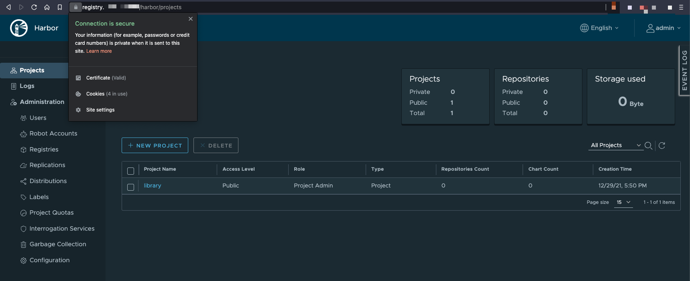

# Kubernetes in a Home Lab Environment
This repository should contain all required steps, manifests and resources to set up a K8s in a home lab environment. Its status should be viewed as "work in progress" since I plan to improve various things in the future.

As I will include more and more cloud native technologies in this guide, you should probably instead have a look at my ["Quick & Dirty, Copy & Paste, Single-Host Kubernetes Setup"](https://gist.github.com/PhilipSchmid/57ce0801fbe7b68f70b9b58e1e3225b3) guide in case you simply want to spin up a minimal local K8s cluster (with networking, ingress and storage) within a few minutes.

In the end, I will probably run some applications on top of this technology stack, but the main goal is to strengthen my knowledge on different new (and sometimes fancy) cloud native and Kubernetes related tools. That's also the reason why this technology stack **should not be viewed as production ready**, since the chaining of the different tools and their configurations has not been tested really well.


# Technologies
The technologies down here will probably change in the future. Nevertheless, the following table should provide you a small overview over currently used technologies.

| What                   | Technology                                        | Status     |
| ---------------------- | ------------------------------------------------- | ---------- |
| DNS Provider           | DigitalOcean (automated with External-DNS)        | Done       |
| OS (Intel NUC)         | Rocky Linux 8.6                                   | Done       |
| Distributon            | Rancher (RKE2)                                    | Done       |
| CRI                    | containerd (included in RKE2)                     | Done       |
| CNI                    | Cilium                                            | Done       |
| CSI                    | NFS SubDir External Provisioner                   | Done       |
| Certificate Handling   | Cert-Manager with Let's Encrypt (DNS Challenge)   | Done       |
| Ingress Controller     | Nginx                                             | Done       |
| Control Plane          | Rancher 2.6                                       | Done       |
| Control Plane Backup   | Rancher Backups                                   | Done       |
| Monitoring             | Prometheus Stack via Rancher Monitoring           | Done       |
| Rancher Logging        | Banzai Cloud Logging Operator via Rancher Logging | Done       |
| Container Registry     | Harbor                                            | Done       |
| Logging                | Grafana Loki (via Rancher Logging)                | Done       |
| Persistent Data Backup | Kanister                                          | On hold *  |
| App Deployment         | Helm & Fleet                                      | Deprecated |

`*` On hold since this feature is currently not needed.

# Table of Content
- [Kubernetes in a Home Lab Environment](#kubernetes-in-a-home-lab-environment)
- [Technologies](#technologies)
- [Table of Content](#table-of-content)
- [Hardware](#hardware)
- [Prerequisites](#prerequisites)
  - [Host OS](#host-os)
    - [Disable Swap](#disable-swap)
  - [Working Directory](#working-directory)
  - [Kubectl, Helm & RKE2](#kubectl-helm--rke2)
  - [VPN Remote Access to the Host via Wireguard (optional)](#vpn-remote-access-to-the-host-via-wireguard-optional)
- [K8s Cluster Setup](#k8s-cluster-setup)
  - [RKE2 Setup](#rke2-setup)
    - [Basic Configuration](#basic-configuration)
    - [Firewall](#firewall)
      - [Firewalld (and nftables)](#firewalld-and-nftables)
      - [Cilium Host Policies](#cilium-host-policies)
    - [Prevent RKE2 Package Updates](#prevent-rke2-package-updates)
  - [Starting RKE2](#starting-rke2)
  - [Configure Kubectl (on RKE2 Host)](#configure-kubectl-on-rke2-host)
  - [Troubleshooting RKE2](#troubleshooting-rke2)
- [Basic Infrastructure Components](#basic-infrastructure-components)
  - [Networking using Cilium (CNI)](#networking-using-cilium-cni)
    - [Cilium Prerequisites](#cilium-prerequisites)
    - [Cilium Installation](#cilium-installation)
    - [Cilium Host Policies](#cilium-host-policies-1)
  - [Persistent Storage using NFS-SubDir-External-Provisioner](#persistent-storage-using-nfs-subdir-external-provisioner)
    - [NFS-SubDir-External-Provisioner Prerequisites](#nfs-subdir-external-provisioner-prerequisites)
    - [NFS-SubDir-External-Provisioner Installation](#nfs-subdir-external-provisioner-installation)
- [Infrastructure related Components](#infrastructure-related-components)
  - [Deploy Nginx Ingress Controller](#deploy-nginx-ingress-controller)
    - [Nginx Ingress Controller Prerequisites](#nginx-ingress-controller-prerequisites)
    - [Nginx Ingress Controller Installation](#nginx-ingress-controller-installation)
  - [Cert-Manager](#cert-manager)
    - [Cert-Manager Prerequisites](#cert-manager-prerequisites)
    - [Cert-Manager Installation](#cert-manager-installation)
    - [Let's Encrypt DNS-Challenge DigitalOcean ClusterIssuer](#lets-encrypt-dns-challenge-digitalocean-clusterissuer)
  - [External-DNS](#external-dns)
    - [External-DNS Prerequisites](#external-dns-prerequisites)
    - [External-DNS Installation](#external-dns-installation)
  - [Rancher (2.6.5)](#rancher-265)
    - [Rancher Prerequisites](#rancher-prerequisites)
    - [Rancher Installation](#rancher-installation)
    - [Rancher Backups](#rancher-backups)
      - [Rancher Backups Installation](#rancher-backups-installation)
    - [Rancher Monitoring](#rancher-monitoring)
      - [Cilium & Nginx Ingress Monitoring](#cilium--nginx-ingress-monitoring)
      - [Cilium Grafana Dashboards](#cilium-grafana-dashboards)
      - [Custom Nginx Ingress & Cluster Capacity Management Dashboard](#custom-nginx-ingress--cluster-capacity-management-dashboard)
    - [Rancher Logging](#rancher-logging)
      - [Configure ClusterOutput](#configure-clusteroutput)
      - [Configure ClusterFlow](#configure-clusterflow)
  - [Loki Logging Backend](#loki-logging-backend)
    - [Loki Prerequisites](#loki-prerequisites)
    - [Loki Installation](#loki-installation)
    - [Add Loki Source to Grafana](#add-loki-source-to-grafana)
      - [Explore logs](#explore-logs)
  - [OPA Gatekeeper](#opa-gatekeeper)
    - [OPA Gatekeeper Installation](#opa-gatekeeper-installation)
    - [Applying OPA Gatekeeper Constraints](#applying-opa-gatekeeper-constraints)
  - [Kanister Backup & Restore](#kanister-backup--restore)
- [Application Components](#application-components)
  - [Harbor Registry](#harbor-registry)
    - [Harbor Registry Prerequisites](#harbor-registry-prerequisites)
    - [Rancher Installation](#rancher-installation-1)
- [Deprecated Sections](#deprecated-sections)
  - [GitOps using Fleet](#gitops-using-fleet)
    - [Fleet Installation](#fleet-installation)
    - [Fleet Configuration](#fleet-configuration)
  - [Application Component Deployments using Fleet](#application-component-deployments-using-fleet)
    - [Minio Object Storage](#minio-object-storage)

# Hardware
One goal of this setup is that it should be runnable on a single host. The only exceptions are the external NFS storage from a Synology NAS and the DNS service from DigitalOcean.

In my case, I use an Intel NUC (`NUC10i7FNH2`) with a 12 core CPU (`Intel(R) Core(TM) i7-10710U CPU @ 1.10GHz`) and 64 GB memory (`2 x 32 GB DDR4-2666`).

# Prerequisites

## Host OS
Download Rocky Linux 8.6 from https://rockylinux.org/download and install it using a USB stick. To flash the ISO to the USB, I'll recommend you [Etcher](https://github.com/balena-io/etcher).

### Disable Swap
```bash
free -h
sudo swapoff -a
sed -i.bak -r 's/(.+ swap .+)/#\1/' /etc/fstab
free -h
```

## Working Directory
Create a working directory where e.g. Helm `values.yaml` files will be stored in the future:
```bash
mkdir ~/rke2
cd ~/rke2
```

## Kubectl, Helm & RKE2
Install `kubectl`, `helm` and RKE2 to the host system:
```bash
BINARY_DIR="/usr/local/bin"
cd /tmp
# Helm
wget https://get.helm.sh/helm-v3.9.0-linux-amd64.tar.gz
tar -zxvf helm-*-linux-amd64.tar.gz
sudo mv linux-amd64/helm $BINARY_DIR/helm
sudo chmod +x $BINARY_DIR/helm
# Kubectl
curl -LO "https://storage.googleapis.com/kubernetes-release/release/$(curl -s https://storage.googleapis.com/kubernetes-release/release/stable.txt)/bin/linux/amd64/kubectl"
chmod +x ./kubectl
sudo mv ./kubectl $BINARY_DIR/kubectl
sudo dnf install bash-completion
echo 'alias k="kubectl"' >>~/.bashrc
echo 'alias kgp="kubectl get pods"' >>~/.bashrc
echo 'alias kgn="kubectl get nodes"' >>~/.bashrc
echo 'alias kga="kubectl get all -A"' >>~/.bashrc
echo 'alias fpods="kubectl get pods -A -o wide | grep -v 1/1 | grep -v 2/2 | grep -v 3/3 | grep -v 4/4 | grep -v 5/5 | grep -v 6/6 | grep -v 7/7 | grep -v Completed"' >>~/.bashrc
echo 'source <(kubectl completion bash)' >>~/.bashrc
echo 'complete -F __start_kubectl k' >>~/.bashrc
source ~/.bashrc
# RKE2
curl -sfL https://get.rke2.io | sudo INSTALL_RKE2_CHANNEL=v1.23 sh -
```

Verification:
```
# Helm
$ helm version
version.BuildInfo{Version:"v3.9.0", GitCommit:"7ceeda6c585217a19a1131663d8cd1f7d641b2a7", GitTreeState:"clean", GoVersion:"go1.17.5"}
# Kubectl
$ kubectl version --client=true
Client Version: version.Info{Major:"1", Minor:"24", GitVersion:"v1.24.1", GitCommit:"3ddd0f45aa91e2f30c70734b175631bec5b5825a", GitTreeState:"clean", BuildDate:"2022-05-24T12:26:19Z", GoVersion:"go1.18.2", Compiler:"gc", Platform:"linux/amd64"}
Kustomize Version: v4.5.4
# RKE2
$ rke2 --version
rke2 version v1.23.7+rke2r2 (d0c2bd7f1dbd30f5b7bbc2e3c899d2efde979c25)
go version go1.17.5b7
```

Optional: Install `kubectl` plugins `kubens`, `kubectx` and `tree` via [krew](https://krew.sigs.k8s.io/):
```bash
# Krew installation
(
  set -x; cd "$(mktemp -d)" &&
  OS="$(uname | tr '[:upper:]' '[:lower:]')" &&
  ARCH="$(uname -m | sed -e 's/x86_64/amd64/' -e 's/\(arm\)\(64\)\?.*/\1\2/' -e 's/aarch64$/arm64/')" &&
  KREW="krew-${OS}_${ARCH}" &&
  curl -fsSLO "https://github.com/kubernetes-sigs/krew/releases/latest/download/${KREW}.tar.gz" &&
  tar zxvf "${KREW}.tar.gz" &&
  ./"${KREW}" install krew
)
echo 'export PATH="${KREW_ROOT:-$HOME/.krew}/bin:$PATH"' >>~/.bashrc
# Install kubens and kubectx
kubectl krew install ctx
kubectl krew install ns
# Install kubectl tree
kubectl krew install tree
# Install fzf to use kubens and kubectx in interactive mode
sudo dnf install git
git clone --depth 1 https://github.com/junegunn/fzf.git ~/.fzf
~/.fzf/install
# Add aliases to bashrc
echo 'alias kctx="kubectl-ctx"' >>~/.bashrc
echo 'alias kns="kubectl-ns"' >>~/.bashrc
source ~/.bashrc
```

Sources:
- https://helm.sh/docs/intro/install/
- https://kubernetes.io/docs/tasks/tools/install-kubectl/#install-kubectl-on-linux
- https://docs.rke2.io/install/methods/#rpm
- https://kubernetes.io/docs/tasks/tools/install-kubectl/#optional-kubectl-configurations
- https://krew.sigs.k8s.io/docs/user-guide/setup/install/#bash
- https://github.com/ahmetb/kubectx#kubectl-plugins-macos-and-linux
- https://github.com/junegunn/fzf#using-git

## VPN Remote Access to the Host via Wireguard (optional)
See https://gist.github.com/PhilipSchmid/b2ac0774fa99ec1286d63d2307a570a3 for more information.

# K8s Cluster Setup
## RKE2 Setup

### Basic Configuration
Create a RKE2 config file (`/etc/rancher/rke2/config.yaml`) with the following content:
```yaml
write-kubeconfig-mode: "0644"
tls-san:
  - "k8s.example.com"
# Make a etcd snapshot every 2 hours
etcd-snapshot-schedule-cron: " */2 * * *"
# Keep 56 etcd snapshorts (equals to 2 weeks with 6 a day)
etcd-snapshot-retention: 56
cni:
- none
disable-kube-proxy: "true"
cluster-cidr: "100.64.0.0/14"
service-cidr: "100.68.0.0/16"
cluster-dns: "100.68.0.10"
selinux: "true"
disable:
- rke2-ingress-nginx
kubelet-arg:
- "max-pods=100"
- "eviction-hard=memory.available<250Mi"
- "eviction-soft=memory.available<1Gi"
- "eviction-soft-grace-period=memory.available=2m"
- "kube-reserved=cpu=200m,memory=500Mi"
- "system-reserved=cpu=200m,memory=500Mi"
kube-apiserver-arg:
- "--enable-admission-plugins=NodeRestriction,PodSecurity"
- "--admission-control-config-file=/etc/kubernetes/pss/cluster-default-pss-config.yaml"
kube-apiserver-extra-mount:
- "/etc/rancher/rke2/pss:/etc/kubernetes/pss"
```

**Please note:**
- I set `disable-kube-proxy` to `true` and `cni` to `none`, since I plan to install Cilium as CNI in ["kube-proxy less mode"](https://docs.cilium.io/en/stable/gettingstarted/kubeproxy-free/) (`kubeProxyReplacement: "strict"`). Do not disable kube-proxy if you use another CNI - it will not work afterwards!
- I also disabled `rke2-ingress-nginx` since I wanted to install and configure the Nginx Ingress Controller according to my taste (Daemonset in host network namespace).
- As [PSPs](https://kubernetes.io/docs/reference/access-authn-authz/admission-controllers/#podsecuritypolicy) will be [removed in K8s 1.25](https://kubernetes.io/blog/2021/04/06/podsecuritypolicy-deprecation-past-present-and-future/), we don't even want to start with PSP anymore and instead directly start using [PSA](https://kubernetes.io/docs/reference/access-authn-authz/admission-controllers/#podsecurity) by configuring the regarding admission controller plugin (`PodSecurity`). The RKE2 default value for the `enable-admission-plugins` flag can be seen [here](https://github.com/rancher/rke2/blob/master/pkg/cli/defaults/defaults.go#L31).
- Please be aware that you'll need this same configuration on every single master node when you set up a multi-node cluster. In such a case, you additionally need to configure `token` and `server` (more details in the official [RKE2 server configuration reference](https://docs.rke2.io/install/install_options/server_config/)).

Next, as we want to use PSA, we need to define a default `AdmissionConfiguration` which specifies the default PodSecurityStandard (PSS) policy for all namespaces.

Create a file called `cluster-default-pss-config.yaml` inside the path `/etc/rancher/rke2/pss` and add the following content:
```yaml
apiVersion: apiserver.config.k8s.io/v1
kind: AdmissionConfiguration
plugins:
- name: PodSecurity
  configuration:
    apiVersion: pod-security.admission.config.k8s.io/v1beta1
    kind: PodSecurityConfiguration
    defaults:
      enforce: "baseline"
      enforce-version: "v1.23"
      audit: "baseline"
      audit-version: "v1.23"
      warn: "baseline"
      warn-version: "v1.23"
    exemptions:
      usernames: []
      runtimeClasses: []
      namespaces:
      - kube-system
```

This functions as a default configuration and can be overridden on namespace level. To do so, you simply need to specify the less restrictive PodSecurityStandard (`privileged`) via labels on the namespace resources. Here an example for `demobackend`:
```bash
kubectl label namespace demobackend pod-security.kubernetes.io/enforce=privileged
kubectl label namespace demobackend pod-security.kubernetes.io/enforce-version=v1.23
kubectl label namespace demobackend pod-security.kubernetes.io/audit=privileged
kubectl label namespace demobackend pod-security.kubernetes.io/audit-version=v1.23
kubectl label namespace demobackend pod-security.kubernetes.io/warn=privileged
kubectl label namespace demobackend pod-security.kubernetes.io/warn-version=v1.23
```

**Important:** Please be aware that setting a Namespaces' PSS policy to `privileged` basically means its workload can do anything without any restriction! For that reason, it's absolutely key to only configure this policy when there is really no other option - especially in production. Also, I would highly recommend you to also deploy OPA Gatekeeper in addition to PSA to enforce [custom constraints](https://github.com/open-policy-agent/gatekeeper-library/tree/master/library) and therefore restrict various dangerous configurations.

Verification: Testing PSS enforcement once the `rke2-server` service is started and the cluster is up & running (not yet, for later):
```bash
$ echo 'apiVersion: v1
> kind: Pod
> metadata:
>   name: tshoot
> spec:
>   containers:
>   - args:
>     - "sleep 3600"
>     image: ghcr.io/philipschmid/tshoot:latest
>     name: tshoot
>     securityContext:
>       capabilities:
>         add: ["NET_ADMIN", "SYS_TIME"]
> ' | k apply -f-
Error from server (Forbidden): error when creating "STDIN": pods "tshoot" is forbidden: violates PodSecurity "baseline:v1.23": non-default capabilities (container "tshoot" must not include "NET_ADMIN", "SYS_TIME" in securityContext.capabilities.add)
```

Sources:
- https://kubernetes.io/docs/tutorials/security/cluster-level-pss/
- https://kubernetes.io/docs/concepts/security/pod-security-standards/
- https://kubernetes.io/docs/tasks/configure-pod-container/enforce-standards-namespace-labels/

### Firewall

#### Firewalld (and nftables)
Ensure to open the required ports:
```bash
### RKE2 specific ports
sudo firewall-cmd --add-port=6443/tcp --permanent
sudo firewall-cmd --add-port=10250/tcp --permanent
# Only required when NodePort services are used:
#sudo firewall-cmd --add-port=30000-32767/tcp --permanent
# Only required in a multi-node cluster setup:
#sudo firewall-cmd --add-port=2379/tcp --permanent
#sudo firewall-cmd --add-port=2380/tcp --permanent
#sudo firewall-cmd --add-port=9345/tcp --permanent

# Used for the Rancher Monitoring
sudo firewall-cmd --add-port=9090/tcp --permanent
sudo firewall-cmd --add-port=9091/tcp --permanent
sudo firewall-cmd --add-port=9796/tcp --permanent
sudo firewall-cmd --add-port=6942/tcp --permanent

### CNI specific ports
# 4244/TCP is required when the Hubble Relay is enabled and therefore needs to connect to all agents to collect the flows
sudo firewall-cmd --add-port=4244/tcp --permanent
# Only required in a multi-node cluster setup:
# Cilium healthcheck related permits:
#sudo firewall-cmd --add-port=4240/tcp --permanent
#sudo firewall-cmd --remove-icmp-block=echo-request --permanent
#sudo firewall-cmd --remove-icmp-block=echo-reply --permanent
# Cilium with GENEVE as overlay:
#sudo firewall-cmd --add-port=6081/udp --permanent

### Ingress Controller specific ports
sudo firewall-cmd --add-port=80/tcp --permanent
sudo firewall-cmd --add-port=443/tcp --permanent
sudo firewall-cmd --add-port=10254/tcp --permanent

### Finally apply all the firewall changes
sudo firewall-cmd --reload
```

Verification:
```
$ sudo firewall-cmd --list-all
public (active)
  target: default
  icmp-block-inversion: no
  interfaces: eno1
  sources: 
  services: cockpit dhcpv6-client ssh wireguard
  ports: 6443/tcp 10250/tcp 80/tcp 443/tcp 9796/tcp 9090/tcp 6942/tcp 9091/tcp 10254/tcp 4244/tcp
  protocols: 
  masquerade: yes
  forward-ports: 
  source-ports: 
  icmp-blocks: 
  rich rules: 
```

Source:
- https://docs.rke2.io/install/requirements/#networking

#### Cilium Host Policies
In this guide we use Cilium as CNI. Therefore we have another option to firewall our node instead of using traditional technologies like Firewalld (nftables). Cilium offers a quite powerful feature called [Host Firewall](https://docs.cilium.io/en/stable/gettingstarted/host-firewall/) which allows it to manage firewall rules for the host itself via Kubernetes resources (`CiliumClusterwideNetworkPolicy`). Cilium then uses its advanced eBPF capabilities to actually implement & enforce these rules of host level.

We need a running K8s cluster and Cilium in order to activate Cilium Host Policies. Therefore its configuration is described later in an own Chilium subchapter.

### Prevent RKE2 Package Updates
To provide more stability, I chose to DNF/YUM "mark/hold" the RKE2 related packages so a `dnf update`/`yum update` does not mess around with them.

Add the following line to `/etc/dnf/dnf.conf` and/or `/etc/yum.conf`:
```
exclude=rke2-*
```

This will cause the following packages to be kept back at this exact version as long as the `exclude` configuration is in place:
```
$ sudo rpm -qa "*rke2*"
rke2-common-1.23.7~rke2r2-0.el8.x86_64
rke2-selinux-0.9-1.el8.noarch
rke2-server-1.23.7~rke2r2-0.el8.x86_64
```

Sources:
- https://www.systutorials.com/making-dnf-yum-not-update-certain-packages/
- https://www.commandlinefu.com/commands/view/1451/search-through-all-installed-packages-names-on-rpm-systems

## Starting RKE2
Enable the `rke2-server` service and start it:
```bash
sudo systemctl enable rke2-server --now
```

Verification:
```bash
sudo systemctl status rke2-server
sudo journalctl -u rke2-server -f
```

## Configure Kubectl (on RKE2 Host)
```bash
mkdir ~/.kube
cp /etc/rancher/rke2/rke2.yaml ~/.kube/config
chmod 600 ~/.kube/config
```

Verification:
```
$ kubectl get nodes
NAME                    STATUS     ROLES                       AGE    VERSION
node1.example.com       NotReady   control-plane,etcd,master   101s   v1.23.7+rke2r2
```

## Troubleshooting RKE2
Show RKE2 containers (locally on a RKE2 node):
```bash
# Check if all relevant static pod containers are running:
/var/lib/rancher/rke2/bin/crictl --config /var/lib/rancher/rke2/agent/etc/crictl.yaml ps -a
# If there are exited static pod containers, check their log (e.g. of the kube-apiserver container):
/var/lib/rancher/rke2/bin/crictl --config /var/lib/rancher/rke2/agent/etc/crictl.yaml logs <container-id>
# If the static pod container is running, you can exec into it to even troubleshoot it even more:
/var/lib/rancher/rke2/bin/crictl --config /var/lib/rancher/rke2/agent/etc/crictl.yaml exec -it <container-id>
```

Show RKE2 nodes (locally on a RKE2 server node):
```bash
/var/lib/rancher/rke2/bin/kubectl --kubeconfig /etc/rancher/rke2/rke2.yaml get nodes
```

Show status uf RKE2 related services:
```bash
# On all RKE2 nodes:
systemctl status rancher-system-agent
# On server node:
systemctl status rke2-server
journalctl -fu rke2-server
# On worker node:
systemctl status rke2-agent
journalctl -fu rke2-agent
```

Important RKE2 (log) files:
- Static RKE2 pods: `/var/lib/rancher/rke2/agent/pod-manifests/*`
- `HelmChart` / `HelmChartConfig` CRs on RKE2 servers: `/var/lib/rancher/rke2/server/manifests/*`
- Kubelet log: `/var/lib/rancher/rke2/agent/logs/kubelet.log`
- Containerd Config TOML: `/var/lib/rancher/rke2/agent/etc/containerd/config.toml`
- Containerd log: `/var/lib/rancher/rke2/agent/containerd/containerd.log`
- Rancher System Agent Config: `/etc/rancher/agent/config.yaml`

# Basic Infrastructure Components

## Networking using Cilium (CNI)

### Cilium Prerequisites

Ensure the eBFP file system is mounted (which should already be the case on RHEL 8 based distros):
```bash
mount | grep /sys/fs/bpf
# if present should output, e.g. "none on /sys/fs/bpf type bpf"...
```

If that's not the case, mount it using the commands down here:
```bash
sudo mount bpffs -t bpf /sys/fs/bpf
sudo bash -c 'cat <<EOF >> /etc/fstab
none /sys/fs/bpf bpf rw,relatime 0 0
EOF'
```

Prepare & add the Helm chart repo:
```bash
cd ~/rke2
mkdir cilium
helm repo add cilium https://helm.cilium.io/
helm repo update
```

Sources:
- https://docs.cilium.io/en/stable/operations/system_requirements/#mounted-ebpf-filesystem

### Cilium Installation
Create a `values.yaml` file with the following configuration:
```yaml
# Set kubeProxyReplacement to "strict" in order to prevent CVE-2020-8554 and fully remove kube-proxy.
# See https://cilium.io/blog/2020/12/11/kube-proxy-free-cve-mitigation for more information.
kubeProxyReplacement: "strict"

# The following two "k8sService.*" properties are required when Cilium is configured to fully replace kube-proxy since otherways it tries to reach the kube-apiserver on startup via the Service IP which does of course does not work without kube-proxy (iptables rules).
k8sServiceHost: <node-ip-of-node-where-kube-apiserver-is-running>
k8sServicePort: 6443

tunnel: "geneve"

# IMPORTANT: Only enable hostFirewall if you're planing to use this feature and you are not using firewalld etc.
hostFirewall:
  enabled: true

hubble:

  metrics:
    # Configure this serviceMonitor section AFTER Rancher Monitoring is enabled!
    #serviceMonitor:
    #  enabled: true
    enabled:
    - dns:query;ignoreAAAA
    - drop
    - tcp
    - flow
    - icmp
    - http

  ui:
    enabled: true
    ingress:
      enabled: true
      hosts:
        - hubble.example.com
      annotations:
        cert-manager.io/cluster-issuer: lets-encrypt-dns01-production-do
      tls:
      - secretName: letsencrypt-hubble-ui
        hosts:
        - hubble.example.com 

  relay:
    enabled: true

# Since we only have 1 node, we only need 1 replica:
operator:
  replicas: 1
  # Configure this prometheus section AFTER Rancher Monitoring is enabled!
  #prometheus:
  #  enabled: true
  #  serviceMonitor:
  #    enabled: true

ipam:
  operator:
    clusterPoolIPv4PodCIDRList:
    - "100.64.0.0/14"

prometheus:
  enabled: true
  # Configure this serviceMonitor section AFTER Rancher Monitoring is enabled!
  #serviceMonitor:
  #  enabled: true
```
**Note:** Check the official [cilium/values.yaml](https://github.com/cilium/cilium/blob/master/install/kubernetes/cilium/values.yaml) in order to see all available values.

Finally install the Cilium helm chart:
```bash
helm upgrade -i --atomic cilium cilium/cilium \
  --version 1.11.6 \
  --namespace kube-system \
  --set upgradeCompatibility=1.11 \
  -f values.yaml
```

**Hint 1**: The `--set upgradeCompatibility=1.11` flag is only recommended when upgrading an already existing Cilium version. The value (in this example `1.11`) should be set to the initial version of Cilium which was installed in this cluster. More details about this can be seen in the [official documentation](https://docs.cilium.io/en/stable/operations/upgrade/#step-2-use-helm-to-upgrade-your-cilium-deployment).

**Hint 2**: When upgrading from an older Cilium version, it's recommended to run the pre-flight check first:
```bash
helm template cilium/cilium --version 1.11.6 \
  --namespace=kube-system \
  --set preflight.enabled=true \
  --set agent=false \
  --set operator.enabled=false \
  --set k8sServiceHost=<node-ip-of-node-where-kube-apiserver-is-running> \
  --set k8sServicePort=6443 \
  > cilium-preflight.yaml
kubectl create -f cilium-preflight.yaml
```

If all pods of this check are up and running, you can clean it up and run the actual `helm upgrade` command from above. Pre-flight status and cleanup:
```bash
# Check if all replicas are up and ready:
kubectl get daemonset -n kube-system | sed -n '1p;/cilium/p'
kubectl get deployment -n kube-system cilium-pre-flight-check -w
# Cleanup:
kubectl delete -f cilium-preflight.yaml
```

The pre-flight check also pre-pulls the images and therefore helps reducing the downtime during the actual upgrade. This also helps to detect potential `ErrImagePull` errors in advance.

Sources:
- https://docs.cilium.io/en/stable/gettingstarted/k8s-install-default/
- https://docs.cilium.io/en/stable/gettingstarted/k8s-install-etcd-operator/
- https://docs.cilium.io/en/stable/gettingstarted/kubeproxy-free/
- https://docs.cilium.io/en/stable/operations/upgrade/#running-pre-flight-check-required

### Cilium Host Policies
**Important:** Only continue with this subchapter if you are **not** using traditional host firewalls and want to use Cilium Host Policies instead!

Since we are only running a single host (wich all three K8s roles (etcd, control plane, worker)), the rule set here will be quite small and straight forward. We only plan to filter ingress traffic. If you plan to deploy Cilium Host Policies on a multi-node cluster, please consider having a look at my other guide over in the [Puzzle ITC blog post](https://www.puzzle.ch/de/blog/articles/2021/12/16/cilium-host-policies) and/or at the very good and detailed [blog post from Charles-Edouard Brétéché](https://medium.com/@charled.breteche/kubernetes-security-explore-cilium-host-firewall-and-host-policies-de93ea9da38c).

So, let's get started:

First, stop and disable firewalld:
```bash
sudo systemctl disable --now firewalld
sudo systemctl mask --now firewalld
```

Next, enable `PolicyAuditMode`. This is a crucial to-do before applying any host policy custom resources because it’s easy to lock yourself out of your Kubernetes node!
```bash
CILIUM_NAMESPACE=kube-system
for NODE_NAME in $(kubectl get nodes --no-headers=true | awk '{print $1}')
do
    CILIUM_POD_NAME=$(kubectl -n $CILIUM_NAMESPACE get pods -l "k8s-app=cilium" -o jsonpath="{.items[?(@.spec.nodeName=='$NODE_NAME')].metadata.name}")
    HOST_EP_ID=$(kubectl -n $CILIUM_NAMESPACE exec $CILIUM_POD_NAME -c cilium-agent -- cilium endpoint list -o jsonpath='{[?(@.status.identity.id==1)].id}')
    kubectl -n $CILIUM_NAMESPACE exec $CILIUM_POD_NAME -c cilium-agent -- cilium endpoint config $HOST_EP_ID PolicyAuditMode=Enabled
    kubectl -n $CILIUM_NAMESPACE exec $CILIUM_POD_NAME -c cilium-agent -- cilium endpoint config $HOST_EP_ID | grep PolicyAuditMode
done
```

To validate the activated `POLICY (ingress) ENFORCEMENT` mode, use this command here and search for the endpoint with the label `reserved:host` and identity `1`. It should be `Disabled`.
```bash
CILIUM_NAMESPACE=kube-system
for NODE_NAME in $(kubectl get nodes --no-headers=true | awk '{print $1}')
do
    CILIUM_POD_NAME=$(kubectl -n $CILIUM_NAMESPACE get pods -l "k8s-app=cilium" -o jsonpath="{.items[?(@.spec.nodeName=='$NODE_NAME')].metadata.name}")
    kubectl -n $CILIUM_NAMESPACE exec $CILIUM_POD_NAME -c cilium-agent -- cilium endpoint list
done
```

Now we can create our `CiliumClusterwideNetworkPolicy` YAML manifest (`ccnp-rke2-singlehost-host-rule-set.yaml`):
```yaml
apiVersion: "cilium.io/v2"
kind: CiliumClusterwideNetworkPolicy
metadata:
  name: "rke2-singlehost-host-rule-set"
spec:
  description: "Cilium host policy set for RKE2 single nodes"
  nodeSelector:
    matchLabels:
      node.kubernetes.io/instance-type: rke2
  ingress:
  - fromEntities:
    - all
    toPorts:
    - ports:
        # SSH
      - port: "22"
        protocol: TCP
        # Ingress HTTP
      - port: "80"
        protocol: TCP
        # Ingress HTTPS
      - port: "443"
        protocol: TCP
        # Kubernetes API
      - port: "6443"
        protocol: TCP
  - fromEntities:
    - cluster
    toPorts:
    - ports:
        # Cilium Hubble relay
      - port: "4244"
        protocol: TCP
        # Rancher monitoring Cilium operator metrics
      - port: "6942"
        protocol: TCP
        # Cilium cilium-agent Prometheus metrics
      - port: "9090"
        protocol: TCP
        # Cilium cilium-hubble Prometheus metrics
      - port: "9091"
        protocol: TCP
        # Rancher Monitoring Node Exporter
      - port: "9796"
        protocol: TCP
        # RKE2 Kubelet
      - port: "10250"
        protocol: TCP
        # Nginx Metrics
      - port: "10254"
        protocol: TCP
```

Apply the just created `CiliumClusterwideNetworkPolicy`:
```bash
kubectl apply -f ccnp-rke2-singlehost-host-rule-set.yaml
```

If you now run the command to check the activated `POLICY (ingress) ENFORCEMENT` mode once again, you will see it changed from `Disabled` to `Disabled (Audit)` (remember searching for the endpoint with the label `reserved:host` and identity `1`):
```bash
CILIUM_NAMESPACE=kube-system
for NODE_NAME in $(kubectl get nodes --no-headers=true | awk '{print $1}')
do
    CILIUM_POD_NAME=$(kubectl -n $CILIUM_NAMESPACE get pods -l "k8s-app=cilium" -o jsonpath="{.items[?(@.spec.nodeName=='$NODE_NAME')].metadata.name}")
    kubectl -n $CILIUM_NAMESPACE exec $CILIUM_POD_NAME -c cilium-agent -- cilium endpoint list
done
```

In my example, the endpoint output looks like this:
```bash
ENDPOINT   POLICY (ingress)   POLICY (egress)   IDENTITY   LABELS (source:key[=value])                                                                                IPv6   IPv4           STATUS
           ENFORCEMENT        ENFORCEMENT
2710       Disabled (Audit)   Disabled          1          k8s:egress.rke2.io/cluster=true                                                                                                  ready
                                                           k8s:node-role.kubernetes.io/control-plane=true
                                                           k8s:node-role.kubernetes.io/etcd=true
                                                           k8s:node-role.kubernetes.io/master=true
                                                           k8s:node.kubernetes.io/instance-type=rke2
                                                           reserved:host
```

Before we now disable the `PolicyAuditMode`, we need to have a look at the packets which would have been dropped if the rules were already enforced:
```bash
# Set Cilium namespace
CILIUM_NAMESPACE=kube-system
# Print Cilium pod names to console:
CILIUM_POD_NAME=$(kubectl -n $CILIUM_NAMESPACE get pods -l "k8s-app=cilium" -o jsonpath="{.items[*].metadata.name}")
# Find the Cilium endpoint ID of the host itself (again, search for the endpoint the the label "reserved:host"):
kubectl -n $CILIUM_NAMESPACE exec $CILIUM_POD_NAME -c cilium-agent -- cilium endpoint list
# Output all connections (allowed & audited) - in my case HOST_EP_ID was "2710"
kubectl -n $CILIUM_NAMESPACE exec $CILIUM_POD_NAME -c cilium-agent -- cilium monitor -t policy-verdict --related-to <HOST_EP_ID>
```

In my example, I only saw allowed connections (`action allow`) for the relevant ports:
```bash
$ kubectl -n $CILIUM_NAMESPACE exec $CILIUM_POD_NAME -c cilium-agent -- cilium monitor -t policy-verdict --related-to 2710
Listening for events on 12 CPUs with 64x4096 of shared memory
Press Ctrl-C to quit
level=info msg="Initializing dissection cache..." subsys=monitor
Policy verdict log: flow 0x0 local EP ID 2710, remote ID world, proto 6, ingress, action allow, match L4-Only, 10.0.0.20:54037 -> 10.0.0.5:443 tcp SYN
Policy verdict log: flow 0x0 local EP ID 2710, remote ID world, proto 6, ingress, action allow, match L4-Only, 10.0.0.20:54146 -> 10.0.0.5:443 tcp SYN
Policy verdict log: flow 0x0 local EP ID 2710, remote ID world, proto 6, ingress, action allow, match L4-Only, 10.0.0.20:54236 -> 10.0.0.5:22 tcp SYN
Policy verdict log: flow 0x0 local EP ID 2710, remote ID world, proto 6, ingress, action allow, match L4-Only, 10.0.0.20:54236 -> 10.0.0.5:22 tcp SYN
Policy verdict log: flow 0x77be7fd5 local EP ID 2710, remote ID 15525, proto 6, ingress, action allow, match L4-Only, 100.64.0.164:58596 -> 10.0.0.5:6443 tcp SYN
Policy verdict log: flow 0x77be7fd5 local EP ID 2710, remote ID 15525, proto 6, ingress, action allow, match L4-Only, 100.64.0.164:58596 -> 10.0.0.5:6443 tcp SYN
```

Once we're confident that the rule set is fine and no essential connections get blocked, set the policy mode to enforcing (by disabling `PolicyAuditMode`):
```bash
for NODE_NAME in $(kubectl get nodes --no-headers=true | awk '{print $1}')
do
    CILIUM_POD_NAME=$(kubectl -n $CILIUM_NAMESPACE get pods -l "k8s-app=cilium" -o jsonpath="{.items[?(@.spec.nodeName=='$NODE_NAME')].metadata.name}")
    HOST_EP_ID=$(kubectl -n $CILIUM_NAMESPACE exec $CILIUM_POD_NAME -c cilium-agent -- cilium endpoint list -o jsonpath='{[?(@.status.identity.id==1)].id}')
    kubectl -n $CILIUM_NAMESPACE exec $CILIUM_POD_NAME -c cilium-agent -- cilium endpoint config $HOST_EP_ID PolicyAuditMode=Disabled
done
```

The node is now firewalled via Cilium with eBPF in the background, while we can manage the required rules in the same easy way as any other “traditional” Kubernetes NetworkPolicy – via Kubernetes (custom) resources.

Sources:
- https://docs.cilium.io/en/stable/gettingstarted/host-firewall/
- https://www.puzzle.ch/de/blog/articles/2021/12/16/cilium-host-policies

## Persistent Storage using NFS-SubDir-External-Provisioner
Used to provide persistent storage via NFS from the Synology NAS. It creates subdirectories for every Persistent Volume created on the K8s cluster (name schema: `${namespace}-${pvcName}-${pvName}`).

Sources:
- https://github.com/kubernetes-sigs/nfs-subdir-external-provisioner

### NFS-SubDir-External-Provisioner Prerequisites
Prepare & add the Helm chart repo:
```bash
mkdir ~/rke2/nfs-subdir-external-provisioner
helm repo add nfs-subdir-external-provisioner https://kubernetes-sigs.github.io/nfs-subdir-external-provisioner/
helm repo update
```

Ensure the nfs protocol is known to the host system:
```bash
sudo dnf install nfs-utils
```

### NFS-SubDir-External-Provisioner Installation
Create a `values.yaml` file with the following configuration:
```yaml
nfs:
  server: <nfs-server-ip-here>
  path: /volume1/nfs

storageClass:
  create: true
  defaultClass: true
  name: nfs
  accessModes: ReadWriteMany
```

Finally, install the NFS SubDir external provisioner helm chart:
```bash
helm upgrade -i --create-namespace --atomic nfs-subdir-external-provisioner nfs-subdir-external-provisioner/nfs-subdir-external-provisioner \
  --version 4.0.16 \
  --namespace nfs-subdir-provisioner \
  -f values.yaml
```

Sources:
- https://github.com/kubernetes-sigs/nfs-subdir-external-provisioner/tree/master/charts/nfs-subdir-external-provisioner

# Infrastructure related Components

## Deploy Nginx Ingress Controller
The Nginx ingress controller is deployed as Daemonset within the host network namespace. This way the Nginx ingress controller can see the actual client IP where this would not be possible without any workarounds when the Nginx ingress controller would be deployed as Deployment outside the host's network namespace.

### Nginx Ingress Controller Prerequisites
Prepare & add the Helm chart repo:
```bash
mkdir ~/rke2/ingress-nginx
helm repo add ingress-nginx https://kubernetes.github.io/ingress-nginx
helm repo update
```

### Nginx Ingress Controller Installation
Create a `values.yaml` file with the following configuration:
```yaml
controller:
  dnsPolicy: ClusterFirstWithHostNet
  hostNetwork: true
  kind: "DaemonSet"

  # Make use of the IngressClass concept
  ingressClassResource:
    name: nginx
    enabled: true
    default: true
    controllerValue: "k8s.io/ingress-nginx"
  ingressClass: nginx
  # ... nevertheless, still watch of Ingress resources which do not have the spec.ingressClassName field set:
  watchIngressWithoutClass: true

  publishService:
    enabled: false
  
  service:
    enabled: true
    type: ClusterIP

  metrics:
    enabled: true
    # Configure this serviceMonitor section AFTER Rancher Monitoring is enabled!
    #serviceMonitor:
    #  enabled: true

  serviceAccount:
    create: true

  admissionWebhooks:
    enabled: false
```

As our Nginx ingress controller runs in host namespace and uses host ports, it can't comply with our default PSS policy `baseline`. We therefore create the namespace before installing the actual Helm chart so we are able to already set its PSS policy to `privileged`:

```bash
kubectl create namespace ingress-nginx
kubectl label namespace ingress-nginx pod-security.kubernetes.io/enforce=privileged
kubectl label namespace ingress-nginx pod-security.kubernetes.io/enforce-version=v1.23
kubectl label namespace ingress-nginx pod-security.kubernetes.io/audit=privileged
kubectl label namespace ingress-nginx pod-security.kubernetes.io/audit-version=v1.23
kubectl label namespace ingress-nginx pod-security.kubernetes.io/warn=privileged
kubectl label namespace ingress-nginx pod-security.kubernetes.io/warn-version=v1.23
```

Finally, install the Nginx ingress controller helm chart:
```bash
helm upgrade -i --create-namespace --atomic nginx ingress-nginx/ingress-nginx \
  --version 4.1.4 \
  --namespace ingress-nginx \
  -f values.yaml
```

Sources:
- https://kubernetes.github.io/ingress-nginx/deploy/#using-helm
- https://github.com/kubernetes/ingress-nginx/tree/master/charts/ingress-nginx
- https://github.com/kubernetes/ingress-nginx/tree/helm-chart-4.0.13/charts/ingress-nginx

## Cert-Manager

### Cert-Manager Prerequisites
Prepare & add the Helm chart repo:
```bash
helm repo add jetstack https://charts.jetstack.io
helm repo update
```

### Cert-Manager Installation
Install the Cert-Manager controller helm chart:
```bash
helm upgrade -i --create-namespace --atomic cert-manager jetstack/cert-manager \
  --namespace cert-manager \
  --set installCRDs=true \
  --version v1.8.1
```

Verification:
```
$ kubectl get pods --namespace cert-manager
NAME                                       READY   STATUS    RESTARTS   AGE
cert-manager-74f46787b6-548rg              1/1     Running   0          78s
cert-manager-cainjector-748dc889c5-qhlqf   1/1     Running   0          78s
cert-manager-webhook-5b679f47d6-8ddcl      1/1     Running   0          78s
```

Sources:
- https://cert-manager.io/docs/installation/kubernetes/#installing-with-helm

### Let's Encrypt DNS-Challenge DigitalOcean ClusterIssuer
Create a Cert-Manager ClusterIssuer, which can issue Let's Encrypt certificates using the DNS01 challenge via DigitalOcean.

```bash
mkdir ~/rke2/cert-manager
touch lets-encrypt-dns01-do.yaml
```

Paste the following YAML into `lets-encrypt-dns01-do.yaml`:
```yaml
---
apiVersion: v1
kind: Secret
metadata:
  name: digitalocean-dns
  namespace: cert-manager
stringData:
  access-token: "plaintext access-token here"
---
apiVersion: cert-manager.io/v1
kind: ClusterIssuer
metadata:
  name: lets-encrypt-dns01-staging-do
spec:
  acme:
    email: me@example.com
    server: https://acme-staging-v02.api.letsencrypt.org/directory
    privateKeySecretRef:
      name: letsencrypt-stag
    solvers:
    - dns01:
        digitalocean:
          tokenSecretRef:
            name: digitalocean-dns
            key: access-token
---
apiVersion: cert-manager.io/v1
kind: ClusterIssuer
metadata:
  name: lets-encrypt-dns01-production-do
spec:
  acme:
    email: me@example.com
    server: https://acme-v02.api.letsencrypt.org/directory
    privateKeySecretRef:
      name: letsencrypt-prod
    solvers:
    - dns01:
        digitalocean:
          tokenSecretRef:
            name: digitalocean-dns
            key: access-token
```

Apply the `lets-encrypt-dns01-do.yaml` manifest:
```bash
kubectl apply -f lets-encrypt-dns01-do.yaml
```

Verification:
```bash
$ k get clusterissuer
NAME                               READY   AGE
lets-encrypt-dns01-production-do   True    3m51s
lets-encrypt-dns01-staging-do      True    3m51s
```

Sources:
- https://cert-manager.io/docs/configuration/acme/dns01/
- https://cert-manager.io/docs/configuration/acme/dns01/digitalocean/

## External-DNS
Used to automatically create new DNS A records for new Ingress objects (on DigitalOcean).

Sources:
- https://github.com/kubernetes-sigs/external-dns
- https://github.com/bitnami/charts/tree/master/bitnami/external-dns

### External-DNS Prerequisites
Prepare & add the Helm chart repo:

```bash
mkdir ~/rke2/external-dns
helm repo add bitnami https://charts.bitnami.com/bitnami
helm repo update
```

### External-DNS Installation
Create a `values.yaml` file with the following configuration:
```yaml
provider: digitalocean
domainFilters:
- "example.com"
digitalocean:
  apiToken: "access-token here"
```

Finally, install the External-DNS helm chart:
```bash
helm upgrade -i --create-namespace --atomic external-dns bitnami/external-dns \
  --version 6.5.6 \
  --namespace external-dns \
  -f values.yaml
```

Verification:
```bash
kubectl --namespace=external-dns get pods -l "app.kubernetes.io/name=external-dns,app.kubernetes.io/instance=external-dns"
```

## Rancher (2.6.5)

Sources:
- https://rancher.com/docs/rancher/v2.6/en/installation/install-rancher-on-k8s/

### Rancher Prerequisites
Prepare & add the Helm chart repo:

```bash
mkdir ~/rke2/rancher
helm repo add rancher-latest https://releases.rancher.com/server-charts/latest
helm repo update
```

### Rancher Installation
Create a `certificate.yaml` file to issue a Certificate manually:
```yaml
apiVersion: cert-manager.io/v1
kind: Certificate
metadata:
  name: tls-rancher-ingress
  namespace: cattle-system
spec:
  secretName: tls-rancher-ingress
  commonName: rancher.example.com
  dnsNames:
  - rancher.example.com
  issuerRef:
    name: lets-encrypt-dns01-production-do
    kind: ClusterIssuer
```

Apply Certificate:
```bash
kubectl create ns cattle-system
kubectl apply -f certificate.yaml 
```

Verify the Certificate:
```
# Wait a few seconds up to a few minutes
$ kubectl get certificate -n cattle-system
NAME                  READY   SECRET                AGE
tls-rancher-ingress   True    tls-rancher-ingress   2m18s
```

Create a `values.yaml` file with the following configuration:
```yaml
hostname: rancher.example.com
ingress:
  tls:
    source: secret
replicas: 1
auditLog:
  level: 1
bootstrapPassword: <super-secret-generated-password-here>
```

Finally, install the Rancher helm chart:
```bash
helm upgrade -i --create-namespace --atomic rancher rancher-latest/rancher \
  --version 2.6.5 \
  --namespace cattle-system \
  -f values.yaml
```

Verification:
```
$ kubectl -n cattle-system rollout status deploy/rancher
Waiting for deployment "rancher" rollout to finish: 0 of 1 updated replicas are available...
deployment "rancher" successfully rolled out
```


Sources:
- https://rancher.com/docs/rancher/v2.6/en/installation/install-rancher-on-k8s/chart-options/
- https://github.com/rancher/rancher/issues/26850#issuecomment-658644922

### Rancher Backups
Rancher 2.5+ now comes with a [rancher-backup](https://github.com/rancher/charts/tree/main/charts/rancher-backup) which can backup/restore all K8s and CRD resources that Rancher creates and manages.
Backup target can be a Persistent Volume or a S3 bucket.

Sources:
- https://rancher.com/docs/rancher/v2.x/en/backups/v2.5/

#### Rancher Backups Installation
Select the `local` cluster, navigate to the "App & Marketplace" -> "Charts" menu and search for the "Rancher Backups" chart. Configure the settings down here:


Next, change the Rancher Backups PersistentVolume reclaim policy to `Retain` (since the `nfs` Storageclass uses `Delete` by default):

```bash
kubectl patch pv <rancher-backup-pv-name> -p '{"spec":{"persistentVolumeReclaimPolicy":"Retain"}}'
```
Example:
```
$ kubectl patch pv pvc-4dee7ec8-2ef9-4e8b-9dd0-10e093c192a2 -p '{"spec":{"persistentVolumeReclaimPolicy":"Retain"}}'
```

Verification:
```
# Before
$ kubectl get pv
NAME                                       CAPACITY   ACCESS MODES   RECLAIM POLICY   STATUS   CLAIM                                                                                                             STORAGECLASS   REASON   AGE
pvc-4dee7ec8-2ef9-4e8b-9dd0-10e093c192a2   10Gi       RWO            Delete           Bound    cattle-resources-system/rancher-backup-1                                                                          nfs                     29s
# Change Retention Policy
$ kubectl patch pv pvc-4dee7ec8-2ef9-4e8b-9dd0-10e093c192a2 -p '{"spec":{"persistentVolumeReclaimPolicy":"Retain"}}'
persistentvolume/pvc-4dee7ec8-2ef9-4e8b-9dd0-10e093c192a2 patched
# After
$ kubectl get pv
NAME                                       CAPACITY   ACCESS MODES   RECLAIM POLICY   STATUS   CLAIM                                                                                                             STORAGECLASS   REASON   AGE
pvc-4dee7ec8-2ef9-4e8b-9dd0-10e093c192a2   10Gi       RWO            Retain           Bound    cattle-resources-system/rancher-backup-1                                                                          nfs                     56s
```

Finally, navigate to the "Rancher Backups" menu and configure a new scheduled backup job or simply create a new CR which does basically the same:

```yaml
apiVersion: resources.cattle.io/v1
kind: Backup
metadata:
  name: default-backup-all
  annotations:
    field.cattle.io/description: 'Backups everything every 2h (retention: 2 weeks)'
spec:
  encryptionConfigSecretName: 
  resourceSetName: rancher-resource-set
  retentionCount: 168
  schedule: 0 */2 * * *
```

More backup YAML examples can be found here: https://rancher.com/docs/rancher/v2.6/en/backups/configuration/backup-config/

Verification:


### Rancher Monitoring
Since the new Rancher 2.5+ monitoring is already based on the [kube-prometheus-stack](https://github.com/prometheus-community/helm-charts/tree/main/charts/kube-prometheus-stack) I will simply use this one instead of using the upstream kube-prometheus-stack Helm chart.

As Rancher Monitoring needs advanced privileges regarding the PSS policy, it can't comply with our default PSS policy `baseline`. We therefore create the main Rancher Monitoring namespace (`cattle-monitoring-system`) before installing the actual App (Helm chart) so we are able to already set its PSS policy to `privileged`:

```bash
kubectl create namespace cattle-monitoring-system
kubectl label namespace cattle-monitoring-system pod-security.kubernetes.io/enforce=privileged
kubectl label namespace cattle-monitoring-system pod-security.kubernetes.io/enforce-version=v1.23
kubectl label namespace cattle-monitoring-system pod-security.kubernetes.io/audit=privileged
kubectl label namespace cattle-monitoring-system pod-security.kubernetes.io/audit-version=v1.23
kubectl label namespace cattle-monitoring-system pod-security.kubernetes.io/warn=privileged
kubectl label namespace cattle-monitoring-system pod-security.kubernetes.io/warn-version=v1.23
```

Navigate to the "App & Marketplace" -> "Charts" menu in Rancher and search for the "Monitoring" chart. Leave nearly all settings default but enable persistent storage for Prometheus:


Also click on `Edit YAML` and search for the `rke2Proxy` section to disable it:
```yaml
rke2Proxy:
  enabled: false
```
(We simply can't use the kube-proxy metrics target since we disabled it completely ("kube-proxy less" Cilium).)

Also remove the whole `rke2IngressNginx.client.affinity` section as we run everything on a single node.

Next, disable `rke2ingressNginx` as we are also not using this component:
```yaml
rke2ingressNginx:
  enabled: false
```

Continue by searching for the psp settings and disable them:
```yaml
global:
  rbac:
    pspEnabled: false
prometheus-adapter:
  psp:
    create: false
```

Finally, click "Install" and wait a few minutes.

**Note:** If you run into a `StorageClass "nfs": claim Selector is not supported` issue (shown as event on the Prometheus PVC), try to manually remove the empty `selector` section from `prometheus.prometheusSpec.storageSpec.volumeClaimTemplate.spec`, delete the PVC and re-run the Rancher Monitoring installation (see [issues/29755](https://github.com/rancher/rancher/issues/29755#issuecomment-717997959) for more information).

**Hints:**
- Ensure to open `9796/TCP` on the node since the RKE2 deployed node-exporter provides the Rancher Monitoring metrics via this port.
- Ensure all Prometheus targets are healthy by navigating to "Monitoring" -> "Overview" -> "Prometheus Targets".
- If the Grafana pod does not come up properly, ensure your NFS share squash settings allow the Grafana init container to change the ownership of files/directories inside its NFS based PV.

Sources:
- https://rancher.com/docs/rancher/v2.6/en/monitoring-alerting/

#### Cilium & Nginx Ingress Monitoring
Since we now have deployed the Prometheus stack, we should be able to enable the Cilium & Nginx ingress monitoring, which are also based on the `ServiceMonitor` CRDs from the Prometheus stack. Add the following properties to the Cilium `values.yaml` file and redeploy it (keep all other values as shown before):

```yaml
hubble:
  metrics:
    serviceMonitor:
      enabled: true

operator:
  prometheus:
    enabled: true
    port: 6942
    serviceMonitor:
      enabled: true

prometheus:
  serviceMonitor:
    enabled: true
```

**Hint:** Ensure to open `9090/TCP`, `9091/TCP` and `6942/TCP` on the node since cilium exposes the Prometheus metrics on these ports.

Do the same with the Nginx ingress by changing the values down here:
```yaml
controller:
  metrics:
    serviceMonitor:
      enabled: true
```

#### Cilium Grafana Dashboards
There are currently 3 public available Grafana Dashboards from Cilium:

- [Cilium v1.11 Agent Metrics](https://grafana.com/grafana/dashboards/15513)
- [Cilium v1.11 Hubble Metrics](https://grafana.com/grafana/dashboards/15515)
- [Cilium v1.11 Operator Metrics](https://grafana.com/grafana/dashboards/15514)

Download the JSONs, replace the default datasource `${DS_PROMETHEUS}` to `Prometheus` and create ConfigMaps from them:
```bash
sed -i 's/${DS_PROMETHEUS}/Prometheus/g' cilium-agent-metrics.json
sed -i 's/${DS_PROMETHEUS}/Prometheus/g' cilium-hubble-metrics.json
sed -i 's/${DS_PROMETHEUS}/Prometheus/g' cilium-operator-metrics.json
kubectl create configmap -n cattle-dashboards grafana-cilium-agent-metrics-cm --from-file=cilium-agent-metrics.json=cilium-agent-metrics.json
kubectl create configmap -n cattle-dashboards grafana-cilium-hubble-metrics-cm --from-file=cilium-hubble-metrics.json=cilium-hubble-metrics.json
kubectl create configmap -n cattle-dashboards grafana-cilium-operator-metrics-cm --from-file=cilium-operator-metrics.json=cilium-operator-metrics.json
```

Next, label the dashboard JSONs so Grafana takes them up:
```bash
kubectl label configmap -n cattle-dashboards grafana-cilium-agent-metrics-cm grafana_dashboard=1
kubectl label configmap -n cattle-dashboards grafana-cilium-hubble-metrics-cm grafana_dashboard=1
kubectl label configmap -n cattle-dashboards grafana-cilium-operator-metrics-cm grafana_dashboard=1
```

Finally, restart the Grafana pod so the newly created Cilium dashboards:

```bash
kubectl rollout restart deployment -n cattle-monitoring-system rancher-monitoring-grafana
```


Sources:
- https://rancher.com/docs/rancher/v2.6/en/monitoring-alerting/

#### Custom Nginx Ingress & Cluster Capacity Management Dashboard
When installing the Prometheus stack, I also often deploy some other nice Grafana Dashboards like this one for the Nginx ingress:


.. or this one for the cluster capacity management:


If you want these dashboards too, just use the provided manifests:

```bash
kubectl apply -f manifests/nginx-dashboard.yaml
kubectl apply -f manifests/capacity-monitoring-dashboard.yaml
```


### Rancher Logging
Rancher Logging is capable to collect, filter and output logs to different logging backend like ElastiSearch, Splunk, Syslog, Loki, etc. It's based on the [BanzaiCloud Logging Operator](https://github.com/banzaicloud/logging-operator).

**Important:** Implement the following SElinux workaround (if SElinux is enabled) as there is currently an open issue (see [here](https://github.com/rancher/rancher/issues/34387) and [here](https://github.com/rancher/charts/issues/1596)) related to a [wrongly used SElinux type](https://github.com/rancher/charts/blob/dev-v2.6/charts/rancher-logging/100.1.1%2Bup3.17.3/templates/loggings/rke2/daemonset.yaml#L26) (`rke_logreader_t`): https://github.com/rancher/charts/issues/1596#issuecomment-1122775136

```bash
sudo dnf -y install policycoreutils-devel
cat <<EOF >> rke2_logging_bodge.te
module rke2_logging_bodge 1.0;

require {
        type container_logreader_t;

        type container_log_t;
        type syslogd_var_run_t;
        class lnk_file { read getattr };
        class dir { read };
}

typealias container_logreader_t alias rke_logreader_t;

allow container_logreader_t container_log_t:lnk_file { read getattr };
allow container_logreader_t syslogd_var_run_t:dir { read };
EOF
make -f /usr/share/selinux/devel/Makefile rke2_logging_bodge.pp
sudo semodule -i rke2_logging_bodge.pp
```

Navigate to the "App & Marketplace" -> "Charts" menu in Rancher and search for the "Logging" chart. In the YAML editor, set the variable `global.seLinux.enabled` to `true` and the variable `monitoring.serviceMonitor.enabled` to `true`. Also reconfigure `fluentd.resources`. Configure the following values there, as the default memory limit is often not enough:

```yaml
fluentd:
  resources:
    limits:
      cpu: "1"
      memory: 1Gi
    requests:
      cpu: 500m
      memory: 100M
```

Next, search for the psp settings and disable them:
```yaml
global:
  psp:
    enabled: false
rbac:
  psp:
    enabled: false
```

Finally, install it.

#### Configure ClusterOutput
The `ClusterOutput` defines a logging backend where fluentd and fluentbit can send logs to.

Preparation:
```bash
mkdir ~/rke2/rancher-logging
```

Create the following YAML (`clusteroutput-loki.yaml`):
```yaml
apiVersion: logging.banzaicloud.io/v1beta1
kind: ClusterOutput
metadata:
  name: loki
  namespace: cattle-logging-system
spec:
  loki:
    configure_kubernetes_labels: true
    extract_kubernetes_labels: true
    url: http://loki-stack.loki.svc.cluster.local:3100
```

Apply the just created YAML:
```bash
kubectl apply -f clusteroutput-loki.yaml
```

#### Configure ClusterFlow
Flow defines a logging flow with filters and outputs. This means that it connects the filtered logs to the output where to send them.

Create the following YAML (`clusterflow-loki.yaml`) to collect and send all logs to Loki:
```yaml
apiVersion: logging.banzaicloud.io/v1beta1
kind: ClusterFlow
metadata:
  name: loki
  namespace: cattle-logging-system
spec:
  globalOutputRefs:
    - loki
  match:
    - select: {}
```

Apply the just created YAML:
```bash
kubectl apply -f clusterflow-loki.yaml
```

Sources:
- https://rancher.com/docs/rancher/v2.6/en/logging/
- https://rancher.com/docs/rancher/v2.6/en/logging/custom-resource-config/outputs/

## Loki Logging Backend
Loki is used to store container and platform logs received from Rancher Loggings' fluentd instance.

Sources:
- https://github.com/grafana/helm-charts/tree/main/charts/loki-stack
- https://rancher.com/government/enhancing-your-rancher-monitoring-experience-with-grafana-loki
- https://awesome-prometheus-alerts.grep.to/rules.html#loki-1

### Loki Prerequisites
Prepare & add the Helm chart repo:

```bash
mkdir ~/rke2/loki
helm repo add grafana https://grafana.github.io/helm-charts
helm repo update
```

### Loki Installation
Create a `values.yaml` file with the following configuration:
```yaml
promtail:
  enabled: false

loki:
  enabled: true
  rbac:
    pspEnabled: false
  persistence:
    enabled: true
    size: 20Gi
  config:
    compactor:
      retention_enabled: true
  serviceMonitor:
    enabled: true
    prometheusRule:
      enabled: true
      rules:
      #Some examples from https://awesome-prometheus-alerts.grep.to/rules.html#loki
      - alert: LokiProcessTooManyRestarts
        expr: changes(process_start_time_seconds{job=~"loki"}[15m]) > 2
        for: 0m
        labels:
          severity: warning
        annotations:
          summary: Loki process too many restarts (instance {{ $labels.instance }})
          description: "A loki process had too many restarts (target {{ $labels.instance }})\n  VALUE = {{ $value }}\n  LABELS = {{ $labels }}"
      - alert: LokiRequestErrors
        expr: 100 * sum(rate(loki_request_duration_seconds_count{status_code=~"5.."}[1m])) by (namespace, job, route) / sum(rate(loki_request_duration_seconds_count[1m])) by (namespace, job, route) > 10
        for: 15m
        labels:
          severity: critical
        annotations:
          summary: Loki request errors (instance {{ $labels.instance }})
          description: "The {{ $labels.job }} and {{ $labels.route }} are experiencing errors\n  VALUE = {{ $value }}\n  LABELS = {{ $labels }}"
      - alert: LokiRequestPanic
        expr: sum(increase(loki_panic_total[10m])) by (namespace, job) > 0
        for: 5m
        labels:
          severity: critical
        annotations:
          summary: Loki request panic (instance {{ $labels.instance }})
          description: "The {{ $labels.job }} is experiencing {{ printf \"%.2f\" $value }}% increase of panics\n  VALUE = {{ $value }}\n  LABELS = {{ $labels }}"
      - alert: LokiRequestLatency
        expr: (histogram_quantile(0.99, sum(rate(loki_request_duration_seconds_bucket{route!~"(?i).*tail.*"}[5m])) by (le)))  > 1
        for: 5m
        labels:
          severity: critical
        annotations:
          summary: Loki request latency (instance {{ $labels.instance }})
          description: "The {{ $labels.job }} {{ $labels.route }} is experiencing {{ printf \"%.2f\" $value }}s 99th percentile latency\n  VALUE = {{ $value }}\n  LABELS = {{ $labels }}"
```

Finally, install the Loki helm chart:
```bash
helm upgrade -i --create-namespace --atomic loki-stack grafana/loki-stack \
  --version 2.6.4 \
  --namespace loki \
  -f values.yaml
```

### Add Loki Source to Grafana
In order to add Loki as datasource in Grafana, simply create the following ConfigMap (`cm-loki-datasource.yaml`) inside the `cattle-monitoring-system` Namespace and ensure it has the label `grafana_datasource=1` set:
```yaml
apiVersion: v1
kind: ConfigMap
metadata:
  name: grafana-loki-datasource
  namespace: cattle-monitoring-system
  labels:
    grafana_datasource: "1"
data:
  loki-stack-datasource.yaml: |-
    apiVersion: 1
    datasources:
    - name: Loki
      type: loki
      access: proxy
      url: http://loki-stack.loki.svc.cluster.local:3100
      version: 1
```

Finally apply it and restart Grafana to pick the source up:
```bash
# Apply:
kubectl apply -f cm-loki-datasource.yaml
# Grafana Pod restart:
kubectl rollout restart -n cattle-monitoring-system deployment rancher-monitoring-grafana
```

#### Explore logs
In Grafana, navigate to the "Explore" menu and in the top left corner change the datasource from "Prometheus" to "Loki".

Paste the below query in the log browser to test if logs are visible.

```json
{app="prometheus"}
```


## OPA Gatekeeper

### OPA Gatekeeper Installation
Navigate to the "App & Marketplace" -> "Charts" menu in Rancher and search for the "OPA Gatekeeper" chart. Leave nearly all settings default except the following ones:

```yaml
psp:
  enabled: false
controllerManager:
  exemptNamespacePrefixes:
  - "kube-*"
  - "cattle-*"
  - "fleet-*"
```

Now, click "Install" and wait a few minutes.
Finally, apply the following `config.gatekeeper.sh/v1alpha1` config to ensure important control plane namespaces are excluded from OPA Gatekeeper evaluation:

```yaml
apiVersion: config.gatekeeper.sh/v1alpha1
kind: Config
metadata:
  name: config
  namespace: "gatekeeper-system"
spec:
  match:
    - excludedNamespaces: ["kube-*", "cattle-*", "fleet-*"]
      processes: ["*"]
```

Sources:
- https://rancher.com/docs/rancher/v2.6/en/opa-gatekeper/
- https://open-policy-agent.github.io/gatekeeper/website/docs/exempt-namespaces/

### Applying OPA Gatekeeper Constraints
The next step for OPA Gatekeeper would be to apply `ConstraintTemplates` and `Constraints` to enforce/audit specific policies. Luckily, there's a [maintained library for such policies](https://github.com/open-policy-agent/gatekeeper-library/tree/master/library) which helps enormously since we do not have to reinvent the wheel.
To have the exact same security measurements in place as before with PSPs one has to also add OPA Gatekeeper constraints for the following scenarios (as they are not handley by [the `baseline` Pod Security Standard](https://kubernetes.io/docs/concepts/security/pod-security-standards/#baseline)):
- [allow-privilege-escalation](https://github.com/open-policy-agent/gatekeeper-library/tree/master/library/pod-security-policy/allow-privilege-escalation)
- [volumes](https://github.com/open-policy-agent/gatekeeper-library/tree/master/library/pod-security-policy/volumes)
- [users](https://github.com/open-policy-agent/gatekeeper-library/tree/master/library/pod-security-policy/users)
- [flexvolume-drivers](https://github.com/open-policy-agent/gatekeeper-library/tree/master/library/pod-security-policy/flexvolume-drivers)

If you want to do that, apply each `template.yaml` from the linked paths above and slightly adjust the `sample/*/constraint.yaml` according to your needs before also applying them.

## Kanister Backup & Restore
TODO

# Application Components

## Harbor Registry

### Harbor Registry Prerequisites
Prepare & add the Helm chart repo:

```bash
mkdir ~/rke2/harbor
helm repo add harbor https://helm.goharbor.io
helm repo update
```

### Rancher Installation
Create a `values.yaml` file with the following configuration:
```yaml
expose:
  tls:
    certSource: secret
    secret:
      secretName: "tls-harbor-cert"
      notarySecretName: "tls-notary-cert"
  ingress:
    hosts:
      core: registry.example.com
      notary: notary.example.com
    annotations:
      cert-manager.io/cluster-issuer: lets-encrypt-dns01-production-do

externalURL: https://registry.example.com

internalTLS:
  enabled: true

persistence:
  persistentVolumeClaim:
    registry:
      size: 100Gi
    chartmuseum:
      size: 20Gi
    jobservice:
      size: 5Gi
    database:
      size: 5Gi
    redis:
      size: 5Gi
    trivy:
      size: 5Gi

# The initial password of Harbor admin. Change it from portal after launching Harbor
harborAdminPassword: "secure long password here"

# The secret key used for encryption. Must be a string of 16 chars.
secretKey: "secure long secret here"

registry:
  credentials:
    password: "secure long password here"

database:
  internal:
    password: "secure long password here"

metrics:
  enabled: true
  serviceMonitor:
    enabled: true
```

Finally, install the Harbor helm chart:
```bash
helm upgrade -i --create-namespace --atomic harbor harbor/harbor \
  --version v1.9.1 \
  --namespace harbor \
  -f values.yaml
```

Verification:


# Deprecated Sections
This chapter will contain sections which were once installed but never really used. Because of that, I won't update them anymore.

## GitOps using Fleet
I first wanted to use ArgoCD to deploy applications with the GitOps approach on the K8s cluster, but then I realized, Rancher 2.5+ already comes with Fleet preinstalled and that it also offers a quite nice UI integration. I therefore chose to give Fleet a try.

Sources:
- https://rancher.com/docs/rancher/v2.x/en/deploy-across-clusters/fleet
- https://fleet.rancher.io/
- https://github.com/rancher/fleet-examples/

### Fleet Installation
No Fleet installation is required since Rancher 2.5+ already installed this app inside the `fleet-system` namespace.

Verification:
```
$ kubectl -n fleet-system logs -l app=fleet-controller
<output truncated>
time="2020-12-28T12:45:34Z" level=info msg="Cluster registration fleet-local/request-w8hv7, cluster fleet-local/local granted [true]"
$ kubectl -n fleet-system get pods -l app=fleet-controller
NAME                                READY   STATUS    RESTARTS   AGE
fleet-controller-767b564d9f-fshp6   1/1     Running   0          2m35s
```

### Fleet Configuration
To manage the RKE2 `local` cluster, you need to switch to the `fleet-local` namespace as the `local` cluster should already be added there since Rancher 2.5+ automatically deployed a fleet-agent in it:

```
$ kubectl get clusters.fleet.cattle.io -A
NAMESPACE     NAME    BUNDLES-READY   NODES-READY   SAMPLE-NODE             LAST-SEEN              STATUS
fleet-local   local   1/1             1/1           node1.example.com   2020-12-28T12:45:52Z
```


The final fleet basic configuration step is to add a Git repository, which is later used to store the Fleet managed manifests. I chose to also host this on Github inside the private https://github.com/PhilipSchmid/home-lab-fleet-manifests repository.

To allow Fleet to access a private Git repository, you must create a SSH key, which is then added as the deployment key. More information about this process can be found here: https://fleet.rancher.io/gitrepo-add/

```bash
mkdir ~/rke2/fleet
cd ~/rke2/fleet

ssh-keygen -t rsa -b 4096 -m pem -C "Fleet" -f fleet_id_rsa
ssh-keyscan -H github.com 2>/dev/null > github_knownhost

kubectl create secret generic fleet-github-ssh-key \
  -n fleet-local \
  --from-file=ssh-privatekey=fleet_id_rsa \
  --from-file=known_hosts=github_knownhost \
  --type=kubernetes.io/ssh-auth 
```

Do not forget to add the just generated public key as deploy key on the Github Git repository (read permissions should be sufficient)

Finally, it's time to configure the GitRepo CR (`home-lab-fleet-manifests.yaml`):
```yaml
apiVersion: fleet.cattle.io/v1alpha1
kind: GitRepo
metadata:
  name: home-lab-fleet-manifests
  namespace: fleet-local
spec:
  repo: git@github.com:PhilipSchmid/home-lab-fleet-manifests.git
  clientSecretName: fleet-github-ssh-key
  paths:
  - /minio
  - /harbor
```

```bash
kubectl apply -f home-lab-fleet-manifests.yaml
```

Sources:
- https://fleet.rancher.io/gitrepo-add/

## Application Component Deployments using Fleet
Deployed via GitOps (Fleet).

Sources:
- https://fleet.rancher.io/gitrepo-structure/

### Minio Object Storage
Create a `minio/fleet.yaml` file inside the `home-lab-fleet-manifests` Git repository:

```yaml
defaultNamespace: fleet-app-minio
helm:
  chart: minio
  repo: https://helm.min.io/
  releaseName: minio
  version: 8.0.8
  values:
    ingress: 
      enabled: "true"
      hosts:
      - minio.example.com
      tls:
      - hosts:
        - minio.example.com
      annotations:
        nginx.ingress.kubernetes.io/proxy-body-size: 5G
        cert-manager.io/cluster-issuer: lets-encrypt-dns01-production-do
    persistence: 
      size: "100Gi"
      storageClass: "nfs-client"
      accessMode: ReadWriteMany
    metrics:
      serviceMonitor:
        enabled: true
diff:
  comparePatches:
  - apiVersion: networking.k8s.io/v1beta1
    kind: Ingress
    name: minio
    namespace: fleet-app-minio
    operations:
    - {"op":"remove", "path":"/spec/rules/0/http/paths"}
```

**Note:** The `diff.comparePatches` section is required since Fleet would otherwise recognize the Minio Helm chart created Ingress object as `modified` all the time. Error: `Modified(1) [Cluster fleet-local/local]; ingress.networking.k8s.io fleet-app-minio/minio modified {"spec":{"rules":[{"host":"minio.example.com","http":{"paths":[{"backend":{"serviceName":"minio","servicePort":9000},"path":"/"}]}}]}}`

Finally, push this `fleet.yaml` file to the repositories `master` branch. Fleet should then automatically start to deploy the Minio application via the specified Helm chart.


To get the Minio secret and access key, issue the following commands:
```bash
kubectl get secret -n fleet-app-minio minio -o jsonpath='{.data.accesskey}' | base64 -d
kubectl get secret -n fleet-app-minio minio -o jsonpath='{.data.secretkey}' | base64 -d
```

Sources:
- https://github.com/minio/charts
- https://github.com/minio/charts#existing-secret
- https://github.com/rancher/fleet-examples/blob/c6e54d7a56565e52a63de8a2088997b46253c1fb/single-cluster/helm-multi-chart/rancher-monitoring/fleet.yaml#L6
