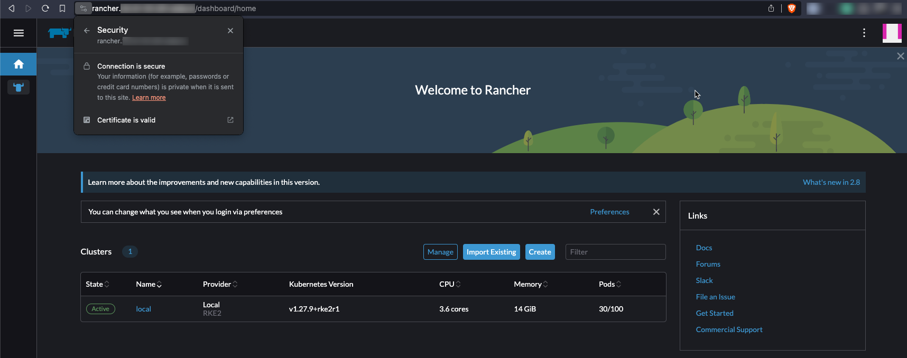

# Kubernetes in a Home Lab Environment
This repository should contain all required steps, manifests and resources to set up a K8s in a home lab environment. Its status should be viewed as "work in progress" since I plan to improve various things in the future.

This technology stack **should not be viewed as production ready**, since the chaining of the different tools and their configurations has not been tested really well.


# Technologies
The technologies down here will probably change in the future. Nevertheless, the following table should provide you a small overview over currently used technologies.

| What                   | Technology                                        | Status     |
| ---------------------- | ------------------------------------------------- | ---------- |
| DNS Provider           | DigitalOcean (automated with External-DNS)        | Done       |
| OS (Intel NUC)         | Rocky Linux 9.1                                   | Done       |
| Distributon            | Rancher (RKE2)                                    | Done       |
| CRI                    | containerd (included in RKE2)                     | Done       |
| CNI                    | Cilium                                            | Done       |
| CSI                    | NFS SubDir External Provisioner                   | Done       |
| Certificate Handling   | Cert-Manager with Let's Encrypt (DNS Challenge)   | Done       |
| Ingress Controller     | Nginx                                             | Done       |
| Monitoring             | Grafana & Kube-Prometheus-Stack                   | Done       |
| Cluster Management     | Rancher 2.8                                       | Done       |

# Table of Content
- [Kubernetes in a Home Lab Environment](#kubernetes-in-a-home-lab-environment)
- [Technologies](#technologies)
- [Table of Content](#table-of-content)
- [Hardware](#hardware)
- [Prerequisites](#prerequisites)
  - [Host OS](#host-os)
    - [Disable Swap](#disable-swap)
    - [Disk Space](#disk-space)
  - [Working Directory](#working-directory)
  - [Kubectl, Helm \& RKE2](#kubectl-helm--rke2)
- [K8s Cluster Setup](#k8s-cluster-setup)
  - [RKE2 Setup](#rke2-setup)
    - [Basic Configuration](#basic-configuration)
    - [Firewall](#firewall)
      - [Firewalld (nftables)](#firewalld-nftables)
      - [Cilium Host Policies](#cilium-host-policies)
    - [Prevent RKE2 Package Updates](#prevent-rke2-package-updates)
  - [Starting RKE2](#starting-rke2)
  - [Configure Kubectl (on RKE2 Host)](#configure-kubectl-on-rke2-host)
  - [Troubleshooting RKE2](#troubleshooting-rke2)
- [Basic Infrastructure Components](#basic-infrastructure-components)
  - [Networking using Cilium (CNI)](#networking-using-cilium-cni)
    - [Cilium Prerequisites](#cilium-prerequisites)
    - [Cilium Installation](#cilium-installation)
    - [Cilium Host Policies](#cilium-host-policies-1)
  - [Persistent Storage using NFS-SubDir-External-Provisioner](#persistent-storage-using-nfs-subdir-external-provisioner)
    - [NFS-SubDir-External-Provisioner Prerequisites](#nfs-subdir-external-provisioner-prerequisites)
    - [NFS-SubDir-External-Provisioner Installation](#nfs-subdir-external-provisioner-installation)
- [Infrastructure related Components](#infrastructure-related-components)
  - [Deploy Nginx Ingress Controller](#deploy-nginx-ingress-controller)
    - [Nginx Ingress Controller Prerequisites](#nginx-ingress-controller-prerequisites)
    - [Nginx Ingress Controller Installation](#nginx-ingress-controller-installation)
  - [Cert-Manager](#cert-manager)
    - [Cert-Manager Prerequisites](#cert-manager-prerequisites)
    - [Cert-Manager Installation](#cert-manager-installation)
    - [Let's Encrypt DNS-Challenge DigitalOcean ClusterIssuer](#lets-encrypt-dns-challenge-digitalocean-clusterissuer)
  - [External-DNS](#external-dns)
    - [External-DNS Prerequisites](#external-dns-prerequisites)
    - [External-DNS Installation](#external-dns-installation)
  - [Rancher (2.8.0)](#rancher-280)
    - [Rancher Prerequisites](#rancher-prerequisites)
    - [Rancher Installation](#rancher-installation)
  - [Grafana](#grafana)
    - [Grafana Prerequisites](#grafana-prerequisites)
    - [Grafana Installation](#grafana-installation)
  - [Kube-Prometheus-Stack](#kube-prometheus-stack)
    - [Kube-Prometheus-Stack Prerequisites](#kube-prometheus-stack-prerequisites)
    - [Kube-Prometheus-Stack Installation](#kube-prometheus-stack-installation)

# Hardware
One goal of this setup is that it should be runnable on a single host. The only exceptions are the external NFS storage from a Synology NAS and the DNS service from DigitalOcean.

In my case, I use an Intel NUC (`NUC10i7FNH2`) with a 12 core CPU (`Intel(R) Core(TM) i7-10710U CPU @ 1.10GHz`) and 64 GB memory (`2 x 32 GB DDR4-2666`).

# Prerequisites

## Host OS
Download Rocky Linux 9.1 from https://rockylinux.org/download and install it using a USB stick. To flash the ISO to the USB, I'll recommend you [Etcher](https://github.com/balena-io/etcher).

### Disable Swap
```bash
free -h
sudo swapoff -a
sudo sed -i.bak -r 's/(.+ swap .+)/#\1/' /etc/fstab
free -h
```

### Disk Space
Ensure `/var/lib/` has enough space available (20GB+ for test/dev, 50GB+ for production). RKE2 will create `/var/lib/rancher` and store images etc. there:
```bash
df -h /var/lib
```

If not, symlink to another partition where's enough disk space available, e.g., `/mnt`:
```bash
sudo mkdir -p /mnt/rancher
sudo ln -s /mnt/rancher /var/lib/rancher
```

**Caution:** Be aware that this change might cause SELinux issues if you have it enabled and `/mnt/rancher` doesn't have the same SELinux context.

## Working Directory
Create a working directory where e.g. Helm `values.yaml` files will be stored in the future:
```bash
mkdir -p ~/rke2
cd ~/rke2
```

## Kubectl, Helm & RKE2
Install `kubectl`, `helm` and RKE2 to the host system:
```bash
BINARY_DIR="/usr/local/bin"
cd /tmp
# Helm
curl -LO https://get.helm.sh/helm-v3.13.3-linux-amd64.tar.gz
tar -zxvf helm-*-linux-amd64.tar.gz
sudo mv linux-amd64/helm $BINARY_DIR/helm
sudo chmod +x $BINARY_DIR/helm
# Kubectl
curl -LO "https://storage.googleapis.com/kubernetes-release/release/$(curl -s https://storage.googleapis.com/kubernetes-release/release/stable.txt)/bin/linux/amd64/kubectl"
chmod +x ./kubectl
sudo mv ./kubectl $BINARY_DIR/kubectl
sudo dnf install -y bash-completion
echo 'alias k="kubectl"' >>~/.bashrc
echo 'alias kgp="kubectl get pods"' >>~/.bashrc
echo 'alias kgn="kubectl get nodes"' >>~/.bashrc
echo 'alias kga="kubectl get all -A"' >>~/.bashrc
echo 'alias fpods="kubectl get pods -A -o wide | grep -v 1/1 | grep -v 2/2 | grep -v 3/3 | grep -v 4/4 | grep -v 5/5 | grep -v 6/6 | grep -v 7/7 | grep -v Completed"' >>~/.bashrc
echo 'source <(kubectl completion bash)' >>~/.bashrc
echo 'complete -F __start_kubectl k' >>~/.bashrc
source ~/.bashrc
# RKE2
curl -sfL https://get.rke2.io | sudo INSTALL_RKE2_CHANNEL=v1.27 sh -
```

Verification:
```bash
# Helm
$ helm version
version.BuildInfo{Version:"v3.13.3", GitCommit:"c8b948945e52abba22ff885446a1486cb5fd3474", GitTreeState:"clean", GoVersion:"go1.20.11"}
# Kubectl
$ kubectl version --client=true
Client Version: v1.29.0
Kustomize Version: v5.0.4-0.20230601165947-6ce0bf390ce3
# RKE2
$ rke2 --version
rke2 version v1.27.9+rke2r1 (378bd59c4f0f97094c23c350d668f37f33aba406)
go version go1.20.12 X:boringcrypto
```

Optional: Install `kubectl` plugins `kubens`, `kubectx` and `tree` via [krew](https://krew.sigs.k8s.io/):
```bash
# Krew installation
sudo dnf install -y git
(
  set -x; cd "$(mktemp -d)" &&
  OS="$(uname | tr '[:upper:]' '[:lower:]')" &&
  ARCH="$(uname -m | sed -e 's/x86_64/amd64/' -e 's/\(arm\)\(64\)\?.*/\1\2/' -e 's/aarch64$/arm64/')" &&
  KREW="krew-${OS}_${ARCH}" &&
  curl -fsSLO "https://github.com/kubernetes-sigs/krew/releases/latest/download/${KREW}.tar.gz" &&
  tar zxvf "${KREW}.tar.gz" &&
  ./"${KREW}" install krew
)
echo 'export PATH="${KREW_ROOT:-$HOME/.krew}/bin:$PATH"' >>~/.bashrc
source ~/.bashrc
# Install kubens and kubectx
kubectl krew install ctx
kubectl krew install ns
# Install kubectl tree
kubectl krew install tree
# Install fzf to use kubens and kubectx in interactive mode
git clone --depth 1 https://github.com/junegunn/fzf.git ~/.fzf
~/.fzf/install
# Add aliases to bashrc
echo 'alias kctx="kubectl-ctx"' >>~/.bashrc
echo 'alias kns="kubectl-ns"' >>~/.bashrc
source ~/.bashrc
```

Sources:
- https://helm.sh/docs/intro/install/
- https://kubernetes.io/docs/tasks/tools/install-kubectl/#install-kubectl-on-linux
- https://docs.rke2.io/install/methods/#rpm
- https://kubernetes.io/docs/tasks/tools/install-kubectl/#optional-kubectl-configurations
- https://krew.sigs.k8s.io/docs/user-guide/setup/install/#bash
- https://github.com/ahmetb/kubectx#kubectl-plugins-macos-and-linux
- https://github.com/junegunn/fzf#using-git


# K8s Cluster Setup
## RKE2 Setup

### Basic Configuration
Create a RKE2 config file (`/etc/rancher/rke2/config.yaml`) with the following content:
```yaml
write-kubeconfig-mode: "0644"
tls-san:
- "k8s.example.com"
# Make a etcd snapshot every 2 hours
etcd-snapshot-schedule-cron: " */2 * * *"
# Keep 56 etcd snapshorts (equals to 2 weeks with 6 a day)
etcd-snapshot-retention: 56
cni:
- none
disable-kube-proxy: "true"
cluster-cidr: "100.64.0.0/14"
service-cidr: "100.68.0.0/16"
cluster-dns: "100.68.0.10"
selinux: "true"
disable:
- rke2-ingress-nginx
kubelet-arg:
- "max-pods=100"
- "eviction-hard=memory.available<250Mi"
- "eviction-soft=memory.available<1Gi"
- "eviction-soft-grace-period=memory.available=2m"
- "kube-reserved=cpu=200m,memory=500Mi"
- "system-reserved=cpu=200m,memory=500Mi"
kube-apiserver-arg:
- "--admission-control-config-file=/etc/kubernetes/pss/cluster-default-pss-config.yaml"
kube-apiserver-extra-mount:
- "/etc/rancher/rke2/pss:/etc/kubernetes/pss"
```

**Please note:**
- I set `disable-kube-proxy` to `true` and `cni` to `none`, since I plan to install Cilium as CNI in ["kube-proxy less mode"](https://docs.cilium.io/en/stable/gettingstarted/kubeproxy-free/) (`kubeProxyReplacement: "strict"`). Do not disable kube-proxy if you use another CNI - it will not work afterwards!
- I also disabled `rke2-ingress-nginx` since I wanted to install and configure the Nginx Ingress Controller according to my taste (Daemonset in host network namespace).
- Please be aware that you'll need this same configuration on every single master node when you set up a multi-node cluster. In such a case, you additionally need to configure `token` and `server` (more details in the official [RKE2 server configuration reference](https://docs.rke2.io/install/install_options/server_config/)).

Next, as we want to use PSA, we need to define a default `AdmissionConfiguration` which specifies the default PodSecurityStandard (PSS) policy for all namespaces.

Create a file called `cluster-default-pss-config.yaml` inside the path `/etc/rancher/rke2/pss` and add the following content:
```yaml
apiVersion: apiserver.config.k8s.io/v1
kind: AdmissionConfiguration
plugins:
- name: PodSecurity
  configuration:
    apiVersion: pod-security.admission.config.k8s.io/v1beta1
    kind: PodSecurityConfiguration
    defaults:
      enforce: "baseline"
      enforce-version: "v1.27"
      audit: "baseline"
      audit-version: "v1.27"
      warn: "baseline"
      warn-version: "v1.27"
    exemptions:
      usernames: []
      runtimeClasses: []
      namespaces:
      - kube-system
```

This functions as a default configuration and can be overridden on namespace level. To do so, you simply need to specify the less restrictive PodSecurityStandard (`privileged`) via labels on the namespace resources. Here an example for `demobackend`:
```bash
kubectl label namespace demobackend pod-security.kubernetes.io/enforce=privileged
kubectl label namespace demobackend pod-security.kubernetes.io/enforce-version=v1.27
kubectl label namespace demobackend pod-security.kubernetes.io/audit=privileged
kubectl label namespace demobackend pod-security.kubernetes.io/audit-version=v1.27
kubectl label namespace demobackend pod-security.kubernetes.io/warn=privileged
kubectl label namespace demobackend pod-security.kubernetes.io/warn-version=v1.27
```

**Important:** Please be aware that setting a Namespaces' PSS policy to `privileged` basically means its workload can do anything without any restriction! For that reason, it's absolutely key to only configure this policy when there is really no other option - especially in production. Also, I would highly recommend you to also deploy OPA Gatekeeper in addition to PSA to enforce [custom constraints](https://github.com/open-policy-agent/gatekeeper-library/tree/master/library) and therefore restrict various dangerous configurations.

Verification: Testing PSS enforcement once the `rke2-server` service is started and the cluster is up & running (not yet, for later):
```bash
$ echo 'apiVersion: v1
> kind: Pod
> metadata:
>   name: tshoot
> spec:
>   containers:
>   - args:
>     - "sleep 3600"
>     image: ghcr.io/philipschmid/tshoot:latest
>     name: tshoot
>     securityContext:
>       capabilities:
>         add: ["NET_ADMIN", "SYS_TIME"]
> ' | k apply -f-
Error from server (Forbidden): error when creating "STDIN": pods "tshoot" is forbidden: violates PodSecurity "baseline:v1.23": non-default capabilities (container "tshoot" must not include "NET_ADMIN", "SYS_TIME" in securityContext.capabilities.add)
```

Sources:
- https://kubernetes.io/docs/tutorials/security/cluster-level-pss/
- https://kubernetes.io/docs/concepts/security/pod-security-standards/
- https://kubernetes.io/docs/tasks/configure-pod-container/enforce-standards-namespace-labels/

### Firewall

#### Firewalld (nftables)
In case you have a host firewall installed and don't want to use [Cilium Host Firewall](https://docs.cilium.io/en/stable/security/host-firewall/), ensure to open the required ports:
```bash
### RKE2 specific ports
sudo firewall-cmd --add-port=6443/tcp --permanent
sudo firewall-cmd --add-port=10250/tcp --permanent
# Only required when NodePort services are used:
#sudo firewall-cmd --add-port=30000-32767/tcp --permanent
# Only required in a multi-node cluster setup:
# ETCD client communication
#sudo firewall-cmd --add-port=2379/tcp --permanent
# ETCD peer communication
#sudo firewall-cmd --add-port=2380/tcp --permanent
# ETCD metrics
#sudo firewall-cmd --add-port=2381/tcp --permanent
# RKE2 management port
#sudo firewall-cmd --add-port=9345/tcp --permanent

# Allow Rancher Monitoring to scrape metrics
# Node Exporter
sudo firewall-cmd --add-port=9100/tcp --permanent
# RKE2 Kubelet
sudo firewall-cmd --add-port=10250/tcp --permanent

### CNI specific ports
# 4244/TCP is required when the Hubble Relay is enabled and therefore needs to connect to all agents to collect the flows
sudo firewall-cmd --add-port=4244/tcp --permanent
# Only required in a multi-node cluster setup:
# Cilium healthcheck related permits:
#sudo firewall-cmd --add-port=4240/tcp --permanent
#sudo firewall-cmd --remove-icmp-block=echo-request --permanent
#sudo firewall-cmd --remove-icmp-block=echo-reply --permanent
# Cilium with VXLAN as overlay:
#sudo firewall-cmd --add-port=8472/udp --permanent
# Used for the Rancher Monitoring to scrape Cilium metrics
sudo firewall-cmd --add-port=9962/tcp --permanent
sudo firewall-cmd --add-port=9963/tcp --permanent
sudo firewall-cmd --add-port=9965/tcp --permanent

### Ingress Controller specific ports
sudo firewall-cmd --add-port=80/tcp --permanent
sudo firewall-cmd --add-port=443/tcp --permanent
sudo firewall-cmd --add-port=10254/tcp --permanent

### Finally apply all the firewall changes
sudo firewall-cmd --reload
```

Source:
- https://docs.rke2.io/install/requirements/#networking

#### Cilium Host Policies
In this guide we use Cilium as CNI. Therefore we have another option to firewall our node instead of using traditional technologies like Firewalld (nftables). Cilium offers a quite powerful feature called [Host Firewall](https://docs.cilium.io/en/stable/gettingstarted/host-firewall/) which allows it to manage firewall rules for the host itself via Kubernetes resources (`CiliumClusterwideNetworkPolicy`). Cilium then uses its advanced eBPF capabilities to actually implement & enforce these rules of host level.

We need a running K8s cluster and Cilium in order to activate Cilium Host Policies. Therefore its configuration is described later in an own Chilium subchapter.

### Prevent RKE2 Package Updates
To provide more stability, I chose to DNF/YUM "mark/hold" the RKE2 related packages so a `dnf update`/`yum update` does not mess around with them.

Add the following line to `/etc/dnf/dnf.conf` and/or `/etc/yum.conf`:
```
exclude=rke2-*
```

This will cause the following packages to be kept back at this exact version as long as the `exclude` configuration is in place:
```
$ sudo rpm -qa "*rke2*"
rke2-selinux-0.17-1.el9.noarch
rke2-common-1.27.9~rke2r1-0.el9.x86_64
rke2-server-1.27.9~rke2r1-0.el9.x86_64
```

Sources:
- https://www.systutorials.com/making-dnf-yum-not-update-certain-packages/
- https://www.commandlinefu.com/commands/view/1451/search-through-all-installed-packages-names-on-rpm-systems

## Starting RKE2
Enable the `rke2-server` service and start it:
```bash
sudo systemctl enable rke2-server --now
```

Verification:
```bash
sudo systemctl status rke2-server
sudo journalctl -u rke2-server -f
```

## Configure Kubectl (on RKE2 Host)
```bash
mkdir ~/.kube
cp /etc/rancher/rke2/rke2.yaml ~/.kube/config
chmod 600 ~/.kube/config
```

Verification:
```
$ kubectl get nodes
NAME                    STATUS     ROLES                       AGE    VERSION
node1.example.com       NotReady   control-plane,etcd,master   79s    v1.27.9+rke2r1
```

## Troubleshooting RKE2
Show RKE2 containers (locally on a RKE2 node):
```bash
# Check if all relevant static pod containers are running:
sudo /var/lib/rancher/rke2/bin/crictl --config /var/lib/rancher/rke2/agent/etc/crictl.yaml ps -a
# If there are exited static pod containers, check their log (e.g. of the kube-apiserver container):
sudo /var/lib/rancher/rke2/bin/crictl --config /var/lib/rancher/rke2/agent/etc/crictl.yaml logs <container-id>
# If the static pod container is running, you can exec into it to even troubleshoot it even more:
sudo /var/lib/rancher/rke2/bin/crictl --config /var/lib/rancher/rke2/agent/etc/crictl.yaml exec -it <container-id>
```

Show RKE2 nodes (locally on a RKE2 server node):
```bash
sudo /var/lib/rancher/rke2/bin/kubectl --kubeconfig /etc/rancher/rke2/rke2.yaml get nodes
```

Show status uf RKE2 related services:
```bash
# On server node:
sudo systemctl status rke2-server
sudo journalctl -fu rke2-server
# On worker node:
sudo systemctl status rke2-agent
sudo journalctl -fu rke2-agent
```

Important RKE2 (log) files:
- Static RKE2 pods: `/var/lib/rancher/rke2/agent/pod-manifests/*`
- `HelmChart` / `HelmChartConfig` CRs on RKE2 servers: `/var/lib/rancher/rke2/server/manifests/*`
- Kubelet log: `/var/lib/rancher/rke2/agent/logs/kubelet.log`
- Containerd Config TOML: `/var/lib/rancher/rke2/agent/etc/containerd/config.toml`
- Containerd log: `/var/lib/rancher/rke2/agent/containerd/containerd.log`

# Basic Infrastructure Components

## Networking using Cilium (CNI)

### Cilium Prerequisites

Ensure the eBFP file system is mounted (which should already be the case on RHEL 9 based distros):
```bash
mount | grep /sys/fs/bpf
# if present should output, e.g. "none on /sys/fs/bpf type bpf"...
```

If that's not the case, mount it using the commands down here:
```bash
sudo mount bpffs -t bpf /sys/fs/bpf
sudo bash -c 'cat <<EOF >> /etc/fstab
none /sys/fs/bpf bpf rw,relatime 0 0
EOF'
```

Prepare & add the Helm chart repo:
```bash
mkdir -p ~/rke2/cilium
cd ~/rke2/cilium
helm repo add cilium https://helm.cilium.io/
helm repo update cilium
```

Sources:
- https://docs.cilium.io/en/stable/operations/system_requirements/#mounted-ebpf-filesystem

### Cilium Installation
Install dependency CRDs:
```bash
# Install Cert-Manager CRDs
kubectl apply -f https://github.com/cert-manager/cert-manager/releases/download/v1.12.7/cert-manager.crds.yaml
# Install Prometheus CRDs
kubectl apply -f https://github.com/prometheus-operator/prometheus-operator/releases/download/v0.70.0/stripped-down-crds.yaml
```

Create a `values.yaml` file with the following configuration:
```yaml
# Enable/disable debug logging
debug:
  enabled: false
  # -- Configure verbosity levels for debug logging
  # This option is used to enable debug messages for operations related to such
  # sub-system such as (e.g. kvstore, envoy, datapath or policy), and flow is
  # for enabling debug messages emitted per request, message and connection.
  #
  # Applicable values:
  # - flow
  # - kvstore
  # - envoy
  # - datapath
  # - policy
  verbose: ~

# Configure unique cluster name & ID
cluster:
  name: cl01
  id: 1

# Set kubeProxyReplacement to "true" in order to prevent CVE-2020-8554 and fully remove kube-proxy.
# See https://cilium.io/blog/2020/12/11/kube-proxy-free-cve-mitigation for more information.
kubeProxyReplacement: "true"

# The following two "k8sService.*" properties are required when Cilium is configured to fully replace kube-proxy since otherways it tries to reach the kube-apiserver on startup via the Service IP which does of course does not work without kube-proxy (iptables rules).
k8sServiceHost: <node-ip-of-node-where-kube-apiserver-is-running>
k8sServicePort: 6443

# Let's use VXLAN-based encapsulation with tunnel-based routing
tunnelProtocol: "vxlan"
routingMode: "tunnel"

# IMPORTANT: Only enable hostFirewall if you're planing to use this feature and you are not using firewalld etc.
hostFirewall:
  enabled: true

hubble:
  metrics:
    serviceMonitor:
      enabled: true
    enableOpenMetrics: true
    enabled:
    # https://docs.cilium.io/en/stable/observability/metrics/#hubble-exported-metrics
    # Remove `;query` from the `dns` line for production -> bad metrics cardinality
    - dns:labelsContext=source_namespace,destination_namespace;query
    - drop:labelsContext=source_namespace,destination_namespace
    - tcp:labelsContext=source_namespace,destination_namespace
    - port-distribution:labelsContext=source_namespace,destination_namespace
    - icmp:labelsContext=source_namespace,destination_namespace;sourceContext=workload-name|reserved-identity;destinationContext=workload-name|reserved-identity
    - flow:sourceContext=workload-name|reserved-identity;destinationContext=workload-name|reserved-identity;labelsContext=source_namespace,destination_namespace
    - "httpV2:exemplars=true;labelsContext=source_ip,source_namespace,source_workload,destination_ip,destination_namespace,destination_workload,traffic_direction;sourceContext=workload-name|reserved-identity;destinationContext=workload-name|reserved-identity"
    - "policy:sourceContext=app|workload-name|pod|reserved-identity;destinationContext=app|workload-name|pod|dns|reserved-identity;labelsContext=source_namespace,destination_namespace"
    dashboards:
      enabled: true
      annotations:
        grafana_folder: "Cilium Hubble Dashboards"
  ui:
    enabled: true
    ingress:
      enabled: true
      hosts:
        - hubble.example.com
      annotations:
        cert-manager.io/cluster-issuer: lets-encrypt-dns01-production-do
      tls:
      - secretName: letsencrypt-hubble-ui
        hosts:
        - hubble.example.com
  relay:
    enabled: true
    prometheus:
      enabled: true
      serviceMonitor:
        enabled: true

# Cilium Operator
operator:
  # Since we only have 1 node, we only need 1 replica:
  replicas: 1
  prometheus:
    enabled: true
    serviceMonitor:
      enabled: true
  dashboards:
    enabled: true
    annotations:
      grafana_folder: "Cilium Operator Dashboards"

# Configure IPAM/PodCIDR
ipam:
  mode: cluster-pool
  operator:
    clusterPoolIPv4PodCIDRList:
    - "100.64.0.0/14"
    clusterPoolIPv4MaskSize: 24

# Enable Cilium Agent metrics
prometheus:
  enabled: true
  serviceMonitor:
    enabled: true

# Cilium Agent Dashboards
dashboards:
  enabled: true
  annotations:
    grafana_folder: "Cilium Agent Dashboards"

# Disable IPv6 support if IPv6 isn't used
ipv6:
  enabled: false
```
**Note:** Check the official [cilium/values.yaml](https://github.com/cilium/cilium/blob/master/install/kubernetes/cilium/values.yaml) in order to see all available values.

Finally install the Cilium helm chart:
```bash
helm upgrade -i cilium cilium/cilium \
  --version 1.14.5 \
  --namespace kube-system \
  --set upgradeCompatibility=1.11 \
  -f values.yaml
```

**Hint 1**: The `--set upgradeCompatibility=1.11` flag is only recommended when upgrading an already existing Cilium version. The value (in this example `1.11`) should be set to the initial version of Cilium which was installed in this cluster. More details about this can be seen in the [official documentation](https://docs.cilium.io/en/stable/operations/upgrade/#step-2-use-helm-to-upgrade-your-cilium-deployment).

**Hint 2**: When upgrading from an older Cilium version, it's recommended to run the pre-flight check first:
```bash
helm template cilium/cilium --version 1.14.5 \
  --namespace=kube-system \
  --set preflight.enabled=true \
  --set agent=false \
  --set operator.enabled=false \
  --set k8sServiceHost=<node-ip-of-node-where-kube-apiserver-is-running> \
  --set k8sServicePort=6443 \
  > cilium-preflight.yaml
kubectl create -f cilium-preflight.yaml
```

If all pods of this check are up and running, you can clean it up and run the actual `helm upgrade` command from above. Pre-flight status and cleanup:
```bash
# Check if all replicas are up and ready:
kubectl get daemonset -n kube-system | sed -n '1p;/cilium/p'
kubectl get deployment -n kube-system cilium-pre-flight-check -w
# Cleanup:
kubectl delete -f cilium-preflight.yaml
```

The pre-flight validates existing CiliumNetworkPolicies for the new Cilium version and also "pre-pulls" the images. This therefore helps reducing the downtime during the actual upgrade. In addition, it helps to detect potential `ErrImagePull` errors in advance.

Sources:
- https://docs.cilium.io/en/stable/gettingstarted/k8s-install-default/
- https://docs.cilium.io/en/stable/network/kubernetes/kubeproxy-free/#kubeproxy-free
- https://docs.cilium.io/en/stable/operations/upgrade/#running-pre-flight-check-required

### Cilium Host Policies
**Important:** Only continue with this subchapter if you are **not** using traditional host firewalls and want to use Cilium Host Policies instead!

Since we are only running a single host (with all three K8s roles (etcd, control plane, worker)), the rule set here will be quite small and straight forward. We only plan to filter ingress traffic. If you plan to deploy Cilium Host Policies on a multi-node cluster, please consider having a look at my other guide over in the [Puzzle ITC blog post](https://www.puzzle.ch/de/blog/articles/2021/12/16/cilium-host-policies), the [cilium-netpol-demo](https://github.com/PhilipSchmid/cilium-netpol-demo) and/or at the very good and detailed [blog post from Charles-Edouard Brétéché](https://medium.com/@charled.breteche/kubernetes-security-explore-cilium-host-firewall-and-host-policies-de93ea9da38c).

So, let's get started:

First, stop and disable firewalld:
```bash
sudo systemctl disable --now firewalld
sudo systemctl mask --now firewalld
```

Next, enable `PolicyAuditMode`. This is a crucial to-do before applying any host policy custom resources because it’s easy to lock yourself out of your Kubernetes node!
```bash
CILIUM_NAMESPACE=kube-system
for NODE_NAME in $(kubectl get nodes --no-headers=true | awk '{print $1}')
do
    CILIUM_POD_NAME=$(kubectl -n $CILIUM_NAMESPACE get pods -l "k8s-app=cilium" -o jsonpath="{.items[?(@.spec.nodeName=='$NODE_NAME')].metadata.name}")
    HOST_EP_ID=$(kubectl -n $CILIUM_NAMESPACE exec $CILIUM_POD_NAME -c cilium-agent -- cilium endpoint list -o jsonpath='{[?(@.status.identity.id==1)].id}')
    kubectl -n $CILIUM_NAMESPACE exec $CILIUM_POD_NAME -c cilium-agent -- cilium endpoint config $HOST_EP_ID PolicyAuditMode=Enabled
    kubectl -n $CILIUM_NAMESPACE exec $CILIUM_POD_NAME -c cilium-agent -- cilium endpoint config $HOST_EP_ID | grep PolicyAuditMode
done
```

To validate the activated `POLICY (ingress) ENFORCEMENT` mode, use this command here and search for the endpoint with the label `reserved:host` and identity `1`. It should be `Disabled`.
```bash
CILIUM_NAMESPACE=kube-system
for NODE_NAME in $(kubectl get nodes --no-headers=true | awk '{print $1}')
do
    CILIUM_POD_NAME=$(kubectl -n $CILIUM_NAMESPACE get pods -l "k8s-app=cilium" -o jsonpath="{.items[?(@.spec.nodeName=='$NODE_NAME')].metadata.name}")
    kubectl -n $CILIUM_NAMESPACE exec $CILIUM_POD_NAME -c cilium-agent -- cilium endpoint list
done
```

Now we can create our `CiliumClusterwideNetworkPolicy` YAML manifest (`ccnp-rke2-singlehost-host-rule-set.yaml`):
```yaml
apiVersion: "cilium.io/v2"
kind: CiliumClusterwideNetworkPolicy
metadata:
  name: "rke2-singlehost-host-rule-set"
spec:
  description: "Cilium host policy set for RKE2 single nodes"
  nodeSelector:
    matchLabels:
      node.kubernetes.io/instance-type: rke2
  ingress:
  - fromEntities:
    - all
    toPorts:
    - ports:
        # SSH
      - port: "22"
        protocol: TCP
        # Ingress HTTP
      - port: "80"
        protocol: TCP
        # Ingress HTTPS
      - port: "443"
        protocol: TCP
        # Kubernetes API
      - port: "6443"
        protocol: TCP
  - fromEntities:
    - cluster
    toPorts:
    - ports:
        # Cilium Hubble server
      - port: "4244"
        protocol: TCP
        # Node Exporter metrics
      - port: "9100"
        protocol: TCP
        # Cilium cilium-agent Prometheus metrics
      - port: "9962"
        protocol: TCP
        # Rancher monitoring Cilium operator metrics
      - port: "9963"
        protocol: TCP
        # Cilium cilium-hubble Prometheus metrics
      - port: "9965"
        protocol: TCP
        # RKE2 Kubelet
      - port: "10250"
        protocol: TCP
```

Apply the just created `CiliumClusterwideNetworkPolicy`:
```bash
kubectl apply -f ccnp-rke2-singlehost-host-rule-set.yaml
```

If you now run the command to check the activated `POLICY (ingress) ENFORCEMENT` mode once again, you will see it changed from `Disabled` to `Disabled (Audit)` (remember searching for the endpoint with the label `reserved:host` and identity `1`):
```bash
CILIUM_NAMESPACE=kube-system
for NODE_NAME in $(kubectl get nodes --no-headers=true | awk '{print $1}')
do
    CILIUM_POD_NAME=$(kubectl -n $CILIUM_NAMESPACE get pods -l "k8s-app=cilium" -o jsonpath="{.items[?(@.spec.nodeName=='$NODE_NAME')].metadata.name}")
    kubectl -n $CILIUM_NAMESPACE exec $CILIUM_POD_NAME -c cilium-agent -- cilium endpoint list
done
```

In my example, the endpoint output looks like this:
```bash
ENDPOINT   POLICY (ingress)   POLICY (egress)   IDENTITY   LABELS (source:key[=value])                                                    IPv6   IPv4           STATUS
           ENFORCEMENT        ENFORCEMENT
46         Disabled (Audit)   Disabled          1          k8s:node-role.kubernetes.io/control-plane=true                                                       ready
                                                           k8s:node-role.kubernetes.io/etcd=true
                                                           k8s:node-role.kubernetes.io/master=true
                                                           k8s:node.kubernetes.io/instance-type=rke2
                                                           reserved:host
```

Before we now disable the `PolicyAuditMode`, we need to have a look at the packets which would have been dropped if the rules were already enforced:
```bash
# Set Cilium namespace
CILIUM_NAMESPACE=kube-system
# Print Cilium pod names to console:
CILIUM_POD_NAME=$(kubectl -n $CILIUM_NAMESPACE get pods -l "k8s-app=cilium" -o jsonpath="{.items[*].metadata.name}")
# Output all connections - in my case HOST_EP_ID was "46"
kubectl -n $CILIUM_NAMESPACE exec $CILIUM_POD_NAME -c cilium-agent -- hubble observe -t policy-verdict -f --identity 1
```

In my example, I only saw allowed connections (`INGRESS ALLOWED`) for some relevant ports:
```bash
$ kubectl -n $CILIUM_NAMESPACE exec $CILIUM_POD_NAME -c cilium-agent -- hubble observe -t policy-verdict -f --identity 1
Sep  4 20:09:21.849: <hidden-ip>:61199 (world) -> 10.0.0.4:6443 (host) policy-verdict:L4-Only INGRESS ALLOWED (TCP Flags: SYN)
Sep  4 20:10:23.292: <hidden-ip>:61206 (world) -> 10.0.0.4:22 (host) policy-verdict:L4-Only INGRESS ALLOWED (TCP Flags: SYN)
```

Once we're confident that the rule set is fine and no essential connections get blocked, set the policy mode to enforcing (by disabling `PolicyAuditMode`):
```bash
for NODE_NAME in $(kubectl get nodes --no-headers=true | awk '{print $1}')
do
    CILIUM_POD_NAME=$(kubectl -n $CILIUM_NAMESPACE get pods -l "k8s-app=cilium" -o jsonpath="{.items[?(@.spec.nodeName=='$NODE_NAME')].metadata.name}")
    HOST_EP_ID=$(kubectl -n $CILIUM_NAMESPACE exec $CILIUM_POD_NAME -c cilium-agent -- cilium endpoint list -o jsonpath='{[?(@.status.identity.id==1)].id}')
    kubectl -n $CILIUM_NAMESPACE exec $CILIUM_POD_NAME -c cilium-agent -- cilium endpoint config $HOST_EP_ID PolicyAuditMode=Disabled
done
```

The node is now firewalled via Cilium with eBPF in the background, while we can manage the required rules in the same easy way as any other “traditional” Kubernetes NetworkPolicy – via Kubernetes (custom) resources.

Sources:
- https://docs.cilium.io/en/stable/gettingstarted/host-firewall/
- https://github.com/PhilipSchmid/cilium-netpol-demo
- https://www.puzzle.ch/de/blog/articles/2021/12/16/cilium-host-policies

## Persistent Storage using NFS-SubDir-External-Provisioner
Used to provide persistent storage via NFS from the Synology NAS. It creates subdirectories for every Persistent Volume created on the K8s cluster (name schema: `${namespace}-${pvcName}-${pvName}`).

Sources:
- https://github.com/kubernetes-sigs/nfs-subdir-external-provisioner

### NFS-SubDir-External-Provisioner Prerequisites
Prepare & add the Helm chart repo:
```bash
mkdir -p ~/rke2/nfs-subdir-external-provisioner
cd ~/rke2/nfs-subdir-external-provisioner
helm repo add nfs-subdir-external-provisioner https://kubernetes-sigs.github.io/nfs-subdir-external-provisioner/
helm repo update nfs-subdir-external-provisioner
```

Ensure the nfs protocol is known to the host system:
```bash
sudo dnf install -y nfs-utils
```

### NFS-SubDir-External-Provisioner Installation
Create a `values.yaml` file with the following configuration:
```yaml
nfs:
  server: <nfs-server-ip-here>
  path: /volume1/nfs

storageClass:
  create: true
  defaultClass: true
  name: nfs
  accessModes: ReadWriteMany
```

Finally, install the NFS SubDir external provisioner helm chart:
```bash
helm upgrade -i --create-namespace nfs-subdir-external-provisioner nfs-subdir-external-provisioner/nfs-subdir-external-provisioner \
  --version 4.0.18 \
  --namespace nfs-subdir-provisioner \
  -f values.yaml
```

Sources:
- https://github.com/kubernetes-sigs/nfs-subdir-external-provisioner/tree/master/charts/nfs-subdir-external-provisioner

# Infrastructure related Components

## Deploy Nginx Ingress Controller
The Nginx ingress controller is deployed as Daemonset within the host network namespace. This way the Nginx ingress controller can see the actual client IP where this would not be possible without any workarounds when the Nginx ingress controller would be deployed as Deployment outside the host's network namespace.

### Nginx Ingress Controller Prerequisites
Prepare & add the Helm chart repo:
```bash
mkdir -p ~/rke2/ingress-nginx
cd ~/rke2/ingress-nginx
helm repo add ingress-nginx https://kubernetes.github.io/ingress-nginx
helm repo update ingress-nginx
```

### Nginx Ingress Controller Installation
Create a `values.yaml` file with the following configuration:
```yaml
controller:
  ingressClassResource:
    name: nginx
    enabled: true
    default: true
    controllerValue: "k8s.io/ingress-nginx"
  ingressClass: nginx
  watchIngressWithoutClass: true

  kind: "DaemonSet"
  hostPort:
    enabled: true
    ports:
      http: 80
      https: 443

  service:
    type: ClusterIP

  metrics:
    enabled: true
    serviceMonitor:
      enabled: true

  serviceAccount:
    create: true

  admissionWebhooks:
    enabled: false
```

As our Nginx ingress controller runs in host namespace and uses host ports, it can't comply with our default PSS policy `baseline`. We therefore create the namespace before installing the actual Helm chart so we are able to already set its PSS policy to `privileged`:

```bash
kubectl create namespace ingress-nginx
kubectl label namespace ingress-nginx pod-security.kubernetes.io/enforce=privileged
kubectl label namespace ingress-nginx pod-security.kubernetes.io/enforce-version=v1.27
kubectl label namespace ingress-nginx pod-security.kubernetes.io/audit=privileged
kubectl label namespace ingress-nginx pod-security.kubernetes.io/audit-version=v1.27
kubectl label namespace ingress-nginx pod-security.kubernetes.io/warn=privileged
kubectl label namespace ingress-nginx pod-security.kubernetes.io/warn-version=v1.27
```

Finally, install the Nginx ingress controller helm chart:
```bash
helm upgrade -i --create-namespace nginx ingress-nginx/ingress-nginx \
  --version 4.9.0 \
  --namespace ingress-nginx \
  -f values.yaml
```

Sources:
- https://kubernetes.github.io/ingress-nginx/deploy/#using-helm
- https://github.com/kubernetes/ingress-nginx/tree/master/charts/ingress-nginx
- https://github.com/kubernetes/ingress-nginx/tree/helm-chart-4.9.0/charts/ingress-nginx

## Cert-Manager

### Cert-Manager Prerequisites
Prepare & add the Helm chart repo:
```bash
helm repo add jetstack https://charts.jetstack.io
helm repo update jetstack
```

### Cert-Manager Installation
Install the Cert-Manager controller helm chart:
```bash
helm upgrade -i --create-namespace cert-manager jetstack/cert-manager \
  --namespace cert-manager \
  --set installCRDs=false \
  --version v1.12.7
```

Verification:
```bash
$ kubectl get pods --namespace cert-manager
NAME                                       READY   STATUS    RESTARTS   AGE
cert-manager-5468bbb5fd-rpshg              1/1     Running   0          29s
cert-manager-cainjector-6f455799dd-kglxp   1/1     Running   0          29s
cert-manager-webhook-54bd8d56d6-k8j5d      1/1     Running   0          29s
```

Sources:
- https://cert-manager.io/docs/installation/kubernetes/#installing-with-helm

### Let's Encrypt DNS-Challenge DigitalOcean ClusterIssuer
Create a Cert-Manager ClusterIssuer, which can issue Let's Encrypt certificates using the DNS01 challenge via DigitalOcean.

```bash
mkdir ~/rke2/cert-manager
touch lets-encrypt-dns01-do.yaml
```

Paste the following YAML into `lets-encrypt-dns01-do.yaml`:
```yaml
---
apiVersion: v1
kind: Secret
metadata:
  name: digitalocean-dns
  namespace: cert-manager
stringData:
  access-token: "plaintext access-token here"
---
apiVersion: cert-manager.io/v1
kind: ClusterIssuer
metadata:
  name: lets-encrypt-dns01-staging-do
spec:
  acme:
    email: me@example.com
    server: https://acme-staging-v02.api.letsencrypt.org/directory
    privateKeySecretRef:
      name: letsencrypt-stag
    solvers:
    - dns01:
        digitalocean:
          tokenSecretRef:
            name: digitalocean-dns
            key: access-token
---
apiVersion: cert-manager.io/v1
kind: ClusterIssuer
metadata:
  name: lets-encrypt-dns01-production-do
spec:
  acme:
    email: me@example.com
    server: https://acme-v02.api.letsencrypt.org/directory
    privateKeySecretRef:
      name: letsencrypt-prod
    solvers:
    - dns01:
        digitalocean:
          tokenSecretRef:
            name: digitalocean-dns
            key: access-token
```

Apply the `lets-encrypt-dns01-do.yaml` manifest:
```bash
kubectl apply -f lets-encrypt-dns01-do.yaml
```

Verification:
```bash
$ k get clusterissuer
NAME                               READY   AGE
lets-encrypt-dns01-production-do   True    5s
lets-encrypt-dns01-staging-do      True    5s
```

Sources:
- https://cert-manager.io/docs/configuration/acme/dns01/
- https://cert-manager.io/docs/configuration/acme/dns01/digitalocean/

## External-DNS
Used to automatically create new DNS A records for new Ingress objects (on DigitalOcean).

Sources:
- https://github.com/kubernetes-sigs/external-dns
- https://github.com/bitnami/charts/tree/master/bitnami/external-dns

### External-DNS Prerequisites
Prepare & add the Helm chart repo:

```bash
mkdir -p ~/rke2/external-dns
cd ~/rke2/external-dns
helm repo add bitnami https://charts.bitnami.com/bitnami
helm repo update bitnami
```

### External-DNS Installation
Create a `values.yaml` file with the following configuration:
```yaml
provider: digitalocean
domainFilters:
- "example.com"
digitalocean:
  apiToken: "access-token here"
```

Finally, install the External-DNS helm chart:
```bash
helm upgrade -i --create-namespace external-dns bitnami/external-dns \
  --version 6.29.0 \
  --namespace external-dns \
  -f values.yaml
```

Verification:
```bash
$ kubectl --namespace=external-dns get pods -l "app.kubernetes.io/name=external-dns,app.kubernetes.io/instance=external-dns"
NAME                            READY   STATUS    RESTARTS   AGE
external-dns-76f6458459-7nbd4   1/1     Running   0          12s
```

## Rancher (2.8.0)

### Rancher Prerequisites
Prepare & add the Helm chart repo:

```bash
mkdir -p ~/rke2/rancher
cd ~/rke2/rancher
helm repo add rancher-latest https://releases.rancher.com/server-charts/latest
helm repo update rancher-latest
```

### Rancher Installation
Create a `certificate.yaml` file to issue a Certificate manually:
```yaml
apiVersion: cert-manager.io/v1
kind: Certificate
metadata:
  name: tls-rancher-ingress
  namespace: cattle-system
spec:
  secretName: tls-rancher-ingress
  commonName: rancher.example.com
  dnsNames:
  - rancher.example.com
  issuerRef:
    name: lets-encrypt-dns01-production-do
    kind: ClusterIssuer
```

Apply Certificate:
```bash
kubectl create ns cattle-system
kubectl apply -f certificate.yaml
```

Verify the Certificate:
```bash
# Wait a few seconds up to a few minutes
$ kubectl get certificate -n cattle-system
NAME                  READY   SECRET                AGE
tls-rancher-ingress   True    tls-rancher-ingress   2m31s
```

Create a `values.yaml` file with the following configuration:
```yaml
hostname: rancher.example.com
ingress:
  tls:
    source: secret
replicas: 1
auditLog:
  level: 1
bootstrapPassword: <super-secret-generated-password-here>
```

Finally, install the Rancher helm chart:
```bash
helm upgrade -i --create-namespace rancher rancher-latest/rancher \
  --version 2.8.0 \
  --namespace cattle-system \
  -f values.yaml
```

Verification:
```bash
$ kubectl -n cattle-system rollout status deploy/rancher
Waiting for deployment "rancher" rollout to finish: 0 of 1 updated replicas are available...
deployment "rancher" successfully rolled out
```



Sources:
- https://rancher.com/docs/rancher/v2.8/en/installation/install-rancher-on-k8s/chart-options/
- https://github.com/rancher/rancher/issues/26850#issuecomment-658644922
- https://rancher.com/docs/rancher/v2.8/en/installation/install-rancher-on-k8s/

## Grafana

### Grafana Prerequisites
Prepare & add the Helm chart repo:

```bash
mkdir -p ~/rke2/grafana
cd ~/rke2/grafana
helm repo add grafana https://grafana.github.io/helm-charts
helm repo update grafana
```

### Grafana Installation
Create a `values.yaml` file with the following configuration:
```yaml
adminPassword: <generate-top-secret-pw>
sidecar:
  dashboards:
    enabled: true
    label: grafana_dashboard
    labelValue: "1"
    searchNamespace: ALL
    folderAnnotation: grafana_folder
    provider:
      foldersFromFilesStructure: true
datasources:
  datasources.yaml:
    apiVersion: 1
    datasources:
    - name: prometheus
      type: prometheus
      url: http://kube-prometheus-stack-prometheus.monitoring.svc.cluster.local.:9090
      access: proxy
      isDefault: true
persistence:
  enabled: true
  size: 2Gi
  storageClassName: nfs
ingress:
  enabled: true
  annotations:
    cert-manager.io/cluster-issuer: lets-encrypt-dns01-production-do
  ingressClassName: nginx
  hosts:
  - grafana.example.com
  tls:
  - secretName: grafana-tls
    hosts:
    - grafana.example.com
```

Finally, install the Grafana helm chart:
```bash
helm upgrade -i grafana grafana/grafana \
  --create-namespace \
  -n monitoring \
  --version 7.0.22 \
  -f values.yaml
```

Verification:
```bash
$ kubectl get pods --namespace monitoring
NAME                       READY   STATUS    RESTARTS   AGE
grafana-6b7f6b6dd7-2x5hg   2/2     Running   0          82s
```

Sources:
- https://github.com/grafana/helm-charts


## Kube-Prometheus-Stack

### Kube-Prometheus-Stack Prerequisites
Prepare & add the Helm chart repo:

```bash
mkdir -p ~/rke2/prometheus
cd ~/rke2/prometheus
helm repo add prometheus-community https://prometheus-community.github.io/helm-charts
helm repo update prometheus-community
```

Apply PSA `privileged` to the `monitoring` namespace as Node Exporter needs `hostPath` mounts to extract metrics:
```bash
kubectl label namespace monitoring pod-security.kubernetes.io/enforce=privileged
kubectl label namespace monitoring pod-security.kubernetes.io/enforce-version=v1.27
kubectl label namespace monitoring pod-security.kubernetes.io/audit=privileged
kubectl label namespace monitoring pod-security.kubernetes.io/audit-version=v1.27
kubectl label namespace monitoring pod-security.kubernetes.io/warn=privileged
kubectl label namespace monitoring pod-security.kubernetes.io/warn-version=v1.27
```

### Kube-Prometheus-Stack Installation
Create a `values.yaml` file with the following configuration:
```yaml
# Disable kube-proxy because we use Cilium KubeProxyReplacement
kubeProxy:
  enabled: false
# The following components are disable because we didn't configure kubeadm to expose those metric endpoints to far:
kubeControllerManager:
  enabled: false
kubeScheduler:
  enabled: false
kubeEtcd:
  enabled: false
prometheus:
  ingress:
    enabled: true
    ingressClassName: nginx
    annotations:
      cert-manager.io/cluster-issuer: lets-encrypt-dns01-production-do
    hosts:
    - prometheus.example.com
    tls:
    - secretName: prometheus-tls
      hosts:
      - prometheus.example.com
  # We only deploy a single Prometheus. This one should therefore watch for all CRs.
  prometheusSpec:
    ruleSelectorNilUsesHelmValues: false
    serviceMonitorSelectorNilUsesHelmValues: false
    podMonitorSelectorNilUsesHelmValues: false
    probeSelectorNilUsesHelmValues: false
    scrapeConfigSelectorNilUsesHelmValues: false
alertmanager:
  ingress:
    enabled: true
    ingressClassName: nginx
    annotations:
      cert-manager.io/cluster-issuer: lets-encrypt-dns01-production-do
    hosts:
    - alertmanager.example.com
    tls:
    - secretName: alertmanager-tls
      hosts:
      - alertmanager.example.com
```

Finally, install the Kube-Prometheus-Stack helm chart:
```bash
helm upgrade -i kube-prometheus-stack prometheus-community/kube-prometheus-stack \
  --skip-crds \
  --create-namespace \
  -n monitoring \
  --version 55.7.0 \
  -f values.yaml
```

Verification:
```bash
$ kubectl get pods --namespace monitoring
NAME                                                        READY   STATUS    RESTARTS   AGE
alertmanager-kube-prometheus-stack-alertmanager-0           2/2     Running   0          18m
grafana-64446977f6-bhj8v                                    2/2     Running   0          97s
kube-prometheus-stack-grafana-696495cfc8-n75fp              3/3     Running   0          18m
kube-prometheus-stack-kube-state-metrics-776cff966c-dnjvq   1/1     Running   0          18m
kube-prometheus-stack-operator-68688565f4-2w4wv             1/1     Running   0          18m
prometheus-kube-prometheus-stack-prometheus-0               2/2     Running   0          18m
```

Sources:
- https://github.com/prometheus-community/helm-charts/tree/main/charts/kube-prometheus-stack
