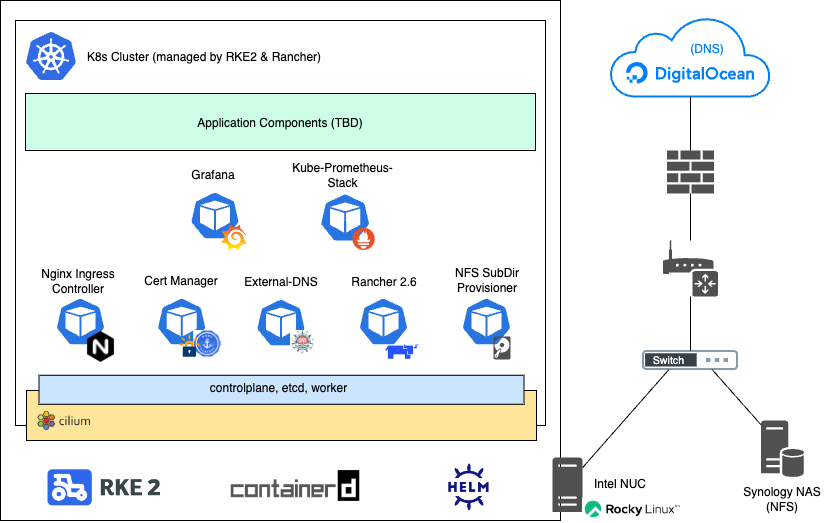

# K8s Home Lab
This repository should contain all required steps, manifests and resources to set up a K8s in a home lab environment. Its status should be viewed as "work in progress" since I plan to improve various things in the future.

## Technologies
Currently there's only a rough plan about which technologies should be used for this setup. The list down here will definitely change as soon as the project progresses.

| What | Technology |
|---|---|
| DNS Provider | DigitalOcean |
| OS (Intel NUC) | Red Hat 8 |
| Distributon | Rancher (RKE2) |
| CRI | containerd |
| CNI | Cilium |
| CSI | NFS / DigitalOcean |
| Certificate Handling | Cert-Manager with Let's Encrypt (DNS Challenge) |
| Ingress Controller | Nginx |
| ETCD Backup | RKE2's S3 Backup Capability (to DigitalOcean Spaces) |
| Data Backup | Kanister |
| App Deployment | Helm & mostly ArgoCD |
| Logging | Grafana Loki (via Rancher Logging) |
| Registry | Harbor |

## Hardware
One goal of this setup is that it should be runnable on a single host. The only exceptions are the external NFS storage from a Synology NAS and the DNS/S3/storage service from DigitalOcean.

In my case I use an Intel NUC (`NUC10i7FNH2`) with a 12 core CPU (`Intel(R) Core(TM) i7-10710U CPU @ 1.10GHz`) and 64 GB memory (`2 x 32 GB DDR4-2666`).

## Topology


## Prerequisites

### Host OS
Download and install Red Hat 8 server from https://developers.redhat.com/topics/linux. After creating a free developer account, you will be able to run 1 Red Hat enterprise server for free (development use only).

### Kubectl, Helm & RKE2
Install `kubectl`, `helm` and RKE2 to the host system:
```bash

```

### VPN Remote Access to the Host via Wireguard (optional)
See https://gist.github.com/PhilipSchmid/b2ac0774fa99ec1286d63d2307a570a3 for more information.

## Getting Started
### RKE2 Setup
```bash

```